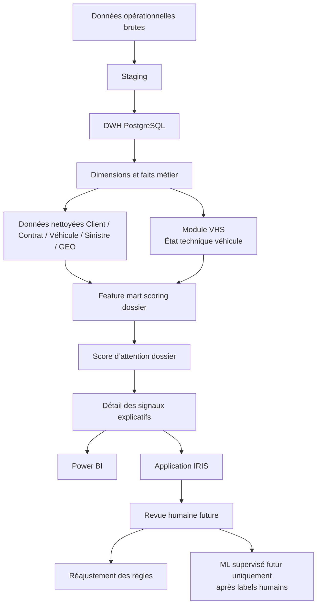

# Méthodologie du score d’attention dossier IRIS

> **Module :** Score d’attention dossier / priorisation des dossiers sinistres automobiles  
> **Projet :** IRIS Auto Fraud Decision Platform — BNA Assurances  
> **Statut :** Méthodologie V1 — Document de cadrage  
> **Version proposée :** `IRIS_CLAIM_ATTENTION_V1_CANDIDATE`  
> **Auteur :** Wiem Benzarti  
> **Principe central :** aide à l’analyse, non accusation

---

## 1. Objectif du document

Ce document définit la méthodologie du prochain module IRIS : le **score d’attention dossier**.

Après la stabilisation de l’ETL/DWH et la finalisation du module VHS — Vehicle Health Score —, l’objectif est de construire une couche de priorisation des dossiers sinistres automobiles à partir de signaux explicables.

Le score d’attention dossier vise à aider les gestionnaires et analystes BNA Assurances à répondre à trois questions principales :

1. Quels dossiers doivent être examinés en priorité ?
2. Quels éléments justifient cette priorité ?
3. Quel est le niveau de confiance de l’analyse au regard de la qualité des données disponibles ?

Ce score ne constitue pas une preuve de fraude. Il ne remplace pas l’analyse humaine. Il fournit une synthèse structurée de signaux pouvant mériter une attention particulière.

> **Les éléments présentés constituent une aide à l’analyse ; la décision finale reste sous la responsabilité du gestionnaire.**

---

## 2. Positionnement métier du score

Le module ne doit pas être présenté comme un « fraud score » ou comme un détecteur automatique de fraude.

Le bon positionnement est celui d’un **score d’attention dossier**.

| Mauvais positionnement | Positionnement retenu |
|---|---|
| Score de fraude | Score d’attention dossier |
| Détection automatique de fraude | Aide à la priorisation |
| Preuve de fraude | Signal à examiner |
| Client suspect | Dossier nécessitant une attention |
| Décision automatique | Aide à l’analyse humaine |

Le score d’attention dossier répond à une logique métier simple :

- attirer l’attention sur certains dossiers ;
- expliquer pourquoi un dossier mérite d’être examiné ;
- prioriser le travail des gestionnaires ;
- structurer les signaux issus du DWH ;
- conserver une traçabilité claire des règles utilisées.

Nom recommandé du module :

```text
Score d’attention dossier IRIS
```

Ce nom est plus adapté au contexte BNA Assurances, car il reste prudent, professionnel et conforme à l’idée d’une aide à la décision.

3. Périmètre fonctionnel

La première version du score concerne uniquement les sinistres automobiles.

Le périmètre V1 est volontairement limité afin de garantir la cohérence métier, la qualité des jointures et l’explicabilité des résultats.

3.1 Unité de scoring

L’unité de scoring est le dossier sinistre automobile.

Chaque ligne scorée correspond à un dossier sinistre.

1 dossier sinistre = 1 score d’attention
3.2 Sources fonctionnelles concernées

Le score pourra s’appuyer sur les données suivantes :

client ;
contrat ;
véhicule ;
sinistre ;
garantie ;
agence ;
géographie ;
tiers ;
conducteur ;
historique sinistres ;
montants ;
dates ;
inspections STAFFIM via le module VHS.
3.3 Source de vérité

La base PostgreSQL/DWH constitue la source de vérité du projet.

Les calculs du score doivent s’appuyer prioritairement sur les tables DWH et mart validées, et non sur des fichiers CSV isolés.

3.4 Dépendance géographique

Les signaux géographiques ne doivent être utilisés qu’après stabilisation de l’ETL GEO.

Les données géographiques incomplètes ou incohérentes ne doivent pas être considérées comme des preuves de comportement suspect. Elles doivent être traitées comme des limites de qualité de données.

4. Architecture générale

Le score d’attention dossier s’inscrit dans l’architecture globale IRIS.



Cette architecture respecte trois principes :

Le DWH est la base centrale.
Le score reste explicable.
La revue humaine prépare l’amélioration future du système.

5. Pourquoi ne pas commencer par le Machine Learning

La première version du score ne doit pas être un modèle Machine Learning.

Cette décision est importante pour des raisons métier, techniques et académiques.

5.1 Absence de labels fiables

Le projet ne dispose pas encore de labels humains validés indiquant quels dossiers ont réellement nécessité une investigation renforcée ou ont été confirmés comme problématiques par les équipes BNA.

Sans ces labels, un modèle supervisé comme XGBoost ne serait pas défendable.

5.2 Besoin d’explicabilité

Les gestionnaires BNA doivent comprendre pourquoi un dossier est priorisé.

Un score basé sur des règles explicables est plus approprié dans une première version qu’un modèle opaque.

5.3 Traçabilité académique

Dans un projet PFE, il est essentiel de montrer :

les règles utilisées ;
les sources de données ;
les limites ;
les hypothèses ;
les contrôles qualité.

Un score déterministe permet une meilleure traçabilité.

5.4 Décision retenue

La version V1 sera donc un score déterministe, pondéré et explicable.

Sont exclus de la version actuelle :

SHAP ;
XGBoost ;
modèle black-box ;
prédiction automatique de fraude ;
décision automatique.

Le Machine Learning pourra être envisagé uniquement après constitution d’un historique de revues humaines fiables.

6. Principe du score d’attention

Le score d’attention dossier est un score numérique compris entre 0 et 100.

Il mesure l’intensité des signaux qui justifient une analyse plus attentive du dossier.

Il ne mesure pas une probabilité de fraude.

6.1 Niveaux métier proposés
Score	Niveau métier
0–24	Analyse standard
25–49	Points à vérifier
50–74	Examen renforcé suggéré
75–100	Examen prioritaire suggéré

Ces seuils sont des seuils candidats. Ils devront être validés après analyse des distributions réelles et échange avec les experts BNA.

6.2 Lecture métier

Un score élevé signifie :

Ce dossier regroupe plusieurs signaux qui méritent une attention particulière.

Il ne signifie pas :

Ce dossier est frauduleux.

7. Score d’attention et niveau de confiance

Le module doit distinguer deux notions.

7.1 Score d’attention

Le score d’attention mesure l’intensité des signaux métier.

Exemples :

récurrence de sinistres ;
montant atypique ;
chronologie inhabituelle ;
récurrence tiers ;
état technique du véhicule ;
incohérence géographique à examiner.

7.2 Niveau de confiance

Le niveau de confiance mesure la fiabilité de l’analyse au regard de la qualité des données.

Niveau de confiance	Interprétation
Élevé	Les jointures principales sont complètes et les dimensions sont fiables
Moyen	Certaines données sont partielles mais l’analyse reste exploitable
Faible	Des clés, dimensions ou informations importantes sont manquantes ou incertaines

7.3 Exemple d’interprétation
Le dossier présente plusieurs signaux à examiner, mais la confiance est moyenne en raison de données géographiques incomplètes.

Cette distinction est essentielle. Un dossier peut avoir un score d’attention élevé, mais une confiance faible si les données sont incomplètes.

8. Familles de signaux retenues

La version V1 du score repose sur sept familles de signaux.

Famille de signal	Objectif	Exemple de question métier
Récurrence client	Identifier les clients avec plusieurs sinistres	Le client a-t-il déclaré plusieurs sinistres récemment ?
Récurrence véhicule	Analyser l’historique du véhicule	Le même véhicule est-il impliqué plusieurs fois ?
Récurrence tiers / conducteur	Détecter les répétitions autour des tiers ou conducteurs	Le même tiers apparaît-il dans plusieurs dossiers ?
Chronologie contrat / sinistre	Vérifier la cohérence temporelle	Le sinistre survient-il peu après le début du contrat ?
Montant atypique	Comparer le montant à des dossiers similaires	Le montant est-il élevé par rapport aux dossiers comparables ?
Cohérence géographique	Vérifier les liens entre lieux, agences et régions	La localisation du sinistre est-elle cohérente avec le contexte du dossier ?
Qualité des données	Mesurer la fiabilité de l’analyse	Des clés ou dimensions importantes sont-elles manquantes ?

Ces familles permettent de produire un score explicable et structuré.

9. Exemples d’indicateurs candidats

Les indicateurs suivants sont proposés pour la V1. Ils devront être validés lors de l’audit de disponibilité des données.

Famille	Indicateur candidat	Description	Direction attendue
Récurrence client	client_claim_count_12m	Nombre de sinistres du client sur 12 mois	Plus élevé = attention accrue
Récurrence client	client_claim_count_24m	Nombre de sinistres du client sur 24 mois	Plus élevé = attention accrue
Récurrence client	days_since_previous_claim	Délai depuis le précédent sinistre client	Plus court = attention accrue
Récurrence véhicule	vehicle_claim_count_12m	Nombre de sinistres du véhicule sur 12 mois	Plus élevé = attention accrue
Récurrence véhicule	vehicle_claim_count_total	Historique total du véhicule	Plus élevé = attention accrue
Récurrence véhicule	linked_vhs_score	Score technique VHS associé	Plus faible = attention technique accrue
Récurrence véhicule	vhs_attention_level	Niveau d’attention VHS	Niveau élevé = attention accrue
Récurrence véhicule	days_between_vhs_and_claim	Délai entre inspection et sinistre	Délai court = contexte à examiner
Récurrence tiers	third_party_claim_count_total	Nombre d’occurrences du même tiers	Plus élevé = attention accrue
Récurrence tiers	client_third_party_pair_count	Répétition client/tiers	Plus élevé = attention accrue
Chronologie	days_contract_start_to_claim	Délai entre début contrat et sinistre	Très court = attention accrue
Chronologie	days_claim_to_declaration	Délai entre sinistre et déclaration	Délai atypique = attention accrue
Chronologie	recent_contract_change_flag	Changement récent du contrat	Oui = attention accrue
Chronologie	recent_guarantee_change_flag	Changement récent de garantie	Oui = attention accrue
Montant	amount_vs_guarantee_median_ratio	Montant comparé à la médiane de la garantie	Ratio élevé = attention accrue
Montant	amount_percentile_by_guarantee	Percentile du montant par garantie	Percentile élevé = attention accrue
Montant	amount_vs_region_median_ratio	Montant comparé à la médiane régionale	Ratio élevé = attention accrue
Géographie	geo_mismatch_flag	Incohérence entre géographie client/agence/sinistre	Oui = à vérifier
Géographie	unknown_geo_flag	Géographie manquante ou inconnue	Impacte la confiance
Géographie	same_location_claim_count	Récurrence sur un même lieu	Plus élevé = attention accrue
Qualité données	missing_keys_count	Nombre de clés manquantes	Diminue la confiance
Qualité données	unknown_dimensions_count	Nombre de dimensions UNKNOWN	Diminue la confiance
Qualité données	weak_join_flag	Jointure faible ou incertaine	Diminue la confiance
Qualité données	migration_2019_flag	Effet potentiel migration 2019	Diminue la confiance

10. Principe de pondération V1

La première version peut utiliser une pondération équilibrée entre les familles de signaux.

Famille de signal	Points maximum candidats
Récurrence client	20
Récurrence véhicule	15
Récurrence tiers / conducteur	20
Chronologie contrat / sinistre	15
Montant atypique	15
Cohérence géographique	10
VHS / état technique	5
Total	100

Cette pondération est candidate. Elle ne doit pas être considérée comme définitive.

Elle devra être ajustée après :

audit de disponibilité des données ;
analyse des distributions ;
validation métier BNA ;
premiers retours de revue humaine.

Le poids VHS est volontairement limité à 5 points, car le VHS mesure l’état technique du véhicule et non une suspicion de fraude.

11. Explication métier du score

Chaque score doit être accompagné d’une explication métier claire.

Le système doit produire pour chaque dossier :

score d’attention ;
niveau d’attention ;
niveau de confiance ;
trois principaux motifs ;
détail des signaux ;
limites éventuelles liées à la qualité des données.

11.1 Exemple d’affichage
Dossier : SNT-XXXX
Score d’attention : 72/100
Niveau : Examen renforcé suggéré
Confiance : Moyenne

Motifs principaux :
1. Récurrence de sinistres client sur 12 mois
2. Montant supérieur aux dossiers comparables
3. Chronologie contrat/sinistre à examiner

11.2 Règle de communication

Les explications doivent rester compréhensibles pour un gestionnaire non technique.

Préférer :

Récurrence de sinistres client à examiner

Éviter :

Feature client_claim_count_12m élevée

12. Tables cibles proposées

Les tables suivantes sont proposées pour la future implémentation. Elles ne sont pas créées dans ce document.

12.1 mart.fact_claim_scoring_features

Objectif : stocker les indicateurs calculés pour chaque dossier sinistre.

Exemples de colonnes :

claim_sk
client_sk
contract_sk
vehicle_sk
agency_sk
geo_sk
claim_date
declaration_date
claim_amount
client_claim_count_12m
vehicle_claim_count_12m
third_party_claim_count_total
days_contract_start_to_claim
days_claim_to_declaration
amount_percentile_by_guarantee
vhs_score
vhs_attention_level
geo_mismatch_flag
missing_keys_count
confidence_level

12.2 mart.fact_claim_attention_score

Objectif : stocker le score final par dossier et par version de scoring.

Exemples de colonnes :

claim_sk
score_version
score_run_id
attention_score
attention_level
confidence_level
main_reason_1
main_reason_2
main_reason_3
created_at

12.3 mart.fact_claim_attention_signal_detail

Objectif : stocker le détail des signaux expliquant le score.

Exemples de colonnes :

claim_sk
score_run_id
signal_family
signal_code
signal_label
signal_value
points
severity
business_explanation

Cette table est essentielle pour Power BI et pour la future interface IRIS, car elle permet d’expliquer le score dossier par dossier.

13. Lien avec le VHS

Le VHS est une brique finalisée du projet IRIS.

Il fournit un contexte technique sur l’état du véhicule à partir des inspections STAFFIM.

Dans le score d’attention dossier, le VHS doit être utilisé avec prudence.

13.1 Rôle du VHS dans le scoring

Le VHS peut aider à identifier :

un véhicule déjà dégradé avant le sinistre ;
un état technique nécessitant une attention ;
une proximité temporelle entre inspection et sinistre ;
une cohérence entre état du véhicule et nature du sinistre.

13.2 Limite du VHS

Le VHS n’est pas :

un score de fraude ;
une probabilité de fraude ;
un modèle ML ;
une preuve contre un client.

Il reste un signal technique limité dans le score global.

13.3 Décision méthodologique

Le VHS ne doit pas dominer le score d’attention dossier.

Il est recommandé de limiter son poids dans la V1 à 5 points maximum.

Le moteur VHS ne doit pas être modifié pour les besoins du scoring dossier.

14. Lien avec la géographie

Les données géographiques peuvent apporter des signaux utiles, mais uniquement si l’ETL GEO est stabilisé.

14.1 Exemples de signaux géographiques
incohérence entre région client, région agence et lieu sinistre ;
récurrence de sinistres dans une même localité ;
géographie inconnue ou incomplète ;
divergence entre lieu de souscription et lieu de déclaration ;
concentration atypique de dossiers sur une zone.

14.2 Précaution

Une donnée géographique manquante ou incohérente ne doit pas être interprétée comme un comportement suspect.

Elle doit être traitée comme une limite de qualité des données.

Exemple :

La géographie du dossier est incomplète ; le niveau de confiance de l’analyse est donc réduit.

15. Gestion de la qualité des données

La qualité des données doit être séparée des signaux métier.

Un problème de données n’est pas un signal de suspicion.

15.1 Exemples de problèmes qualité
client non relié correctement au sinistre ;
véhicule absent ou mal joint ;
tiers manquant ;
géographie UNKNOWN ;
agence non mappée ;
garantie inconnue ;
effet migration 2019 ;
dates incohérentes ou manquantes.

15.2 Impact sur le score

Les problèmes de qualité ne doivent pas augmenter directement le score d’attention comme un signal métier.

Ils doivent plutôt influencer le niveau de confiance.

Exemple :

Situation	Effet recommandé
Données complètes	Confiance élevée
Quelques dimensions UNKNOWN	Confiance moyenne
Clés principales manquantes	Confiance faible
Effet migration 2019 important	Confiance faible ou dossier à interpréter avec prudence

16. Validation attendue du score

Avant toute publication dans Power BI ou utilisation dans IRIS, la version V1 du score devra être validée.

16.1 Contrôles attendus
nombre de dossiers scorés ;
distribution du score 0–100 ;
distribution des niveaux d’attention ;
top familles de signaux ;
proportion de dossiers à confiance faible ;
taux de dimensions UNKNOWN ;
taux de clés manquantes ;
impact de la migration 2019 ;
répartition régionale ;
taux de rattachement VHS ;
cohérence des principaux motifs affichés.

16.2 Résultats attendus

La validation devra répondre à ces questions :

Le score est-il trop concentré sur un seul niveau ?
Les dossiers prioritaires sont-ils expliqués par des motifs lisibles ?
Certaines agences ou régions sont-elles surreprésentées à cause d’un problème de données ?
Le score dépend-il trop du VHS ?
La qualité des données permet-elle une analyse fiable ?

17. Limites de la première version

La version V1 du score présente plusieurs limites assumées.

Limite	Explication
Absence de labels fraude confirmée	Le score ne peut pas être entraîné comme modèle supervisé
Absence de revue humaine historique	Les poids ne sont pas encore calibrés par retour métier
Dépendance au DWH	Le score dépend de la qualité des jointures
Dépendance au GEO	Certains signaux géographiques attendent la stabilisation GEO
Effet migration 2019	Certaines ruptures historiques peuvent affecter l’analyse
Score déterministe	Les règles doivent être validées et ajustées dans le temps
Pas de ML en V1	Choix volontaire pour garantir explicabilité et traçabilité

Ces limites ne bloquent pas la construction du module. Elles doivent être documentées et présentées clairement.

18. Gouvernance future

À terme, le module devra intégrer une logique human-in-the-loop.

Les gestionnaires ou analystes pourront revoir les sorties IRIS et qualifier les dossiers.

18.1 Statuts de revue possibles
attention confirmée ;
niveau abaissé ;
niveau relevé ;
données insuffisantes ;
signal non pertinent ;
commentaire métier ajouté.

18.2 Utilisation des retours

Les retours humains permettront de :

recalibrer les poids ;
corriger certains seuils ;
identifier les signaux peu utiles ;
renforcer les signaux pertinents ;
préparer un futur modèle supervisé si le volume de labels devient suffisant.

18.3 ML futur

Un modèle supervisé pourra être envisagé uniquement après constitution d’un historique de revues humaines fiables.

Même dans ce cas, le modèle futur devra rester explicable, contrôlé et validé par le métier.

19. Roadmap d’implémentation

La construction du score d’attention dossier doit être progressive.

Étape 1 — Méthodologie

Créer le présent document méthodologique.

docs/scoring/claim_attention_scoring_methodology.md
Étape 2 — Audit de préparation des données

Créer un audit DWH pour vérifier la disponibilité des données nécessaires.

docs/scoring/claim_scoring_data_readiness_audit.md
Étape 3 — Spécification des features

Définir les indicateurs exacts, les sources, les colonnes et les règles de calcul.

docs/scoring/claim_attention_feature_specification.md
Étape 4 — Notebook exploratoire read-only

Construire un notebook de vérification des jointures et distributions, sans écriture en base.

notebooks/validation_scoring/01_claim_scoring_data_readiness.ipynb
Étape 5 — Feature mart

Implémenter la table de features dossier.

etl/mart/compute_claim_scoring_features_v1.py
Étape 6 — Score V1 candidate

Implémenter le score d’attention V1.

etl/mart/compute_claim_attention_score_v1_candidate.py
Étape 7 — Validation

Créer un notebook de validation de la distribution du score.

notebooks/validation_scoring/02_validate_claim_attention_score_v1.ipynb
Étape 8 — Documentation de validation

Documenter les résultats.

docs/scoring/claim_attention_validation_summary.md
Étape 9 — Power BI

Préparer les tables mart pour Power BI :

score dossier ;
détail des signaux ;
niveau de confiance ;
répartition par région/agence ;
qualité des données.
Étape 10 — Gouvernance future

Préparer la revue humaine et l’historisation des décisions métier.

20. Conclusion

Le score d’attention dossier IRIS est une couche d’aide à la priorisation des dossiers sinistres automobiles.

Il repose sur des signaux explicables issus du DWH, de l’historique client, de l’historique véhicule, des tiers, de la chronologie, des montants, de la géographie, de la qualité des données et du module VHS.

La version V1 doit rester déterministe, transparente et contrôlable. Elle ne doit pas être présentée comme un modèle automatique de détection de fraude.

Le score d’attention dossier permet de structurer l’analyse, d’améliorer la priorisation et de préparer une future gouvernance human-in-the-loop.

Le score d’attention dossier IRIS constitue une aide à la priorisation ; il oriente l’analyse sans se substituer à la décision humaine.

Contrôles qualité du document
Contrôle	Statut attendu
Positionnement aide à la décision	OK
Absence de vocabulaire accusatoire	OK
Pas de Machine Learning en V1	OK
Pas de SHAP en V1	OK
Pas de XGBoost en V1	OK
Score 0–100 défini	OK
Niveaux d’attention définis	OK
Niveau de confiance séparé	OK
Sept familles de signaux définies	OK
VHS limité à un signal technique	OK
Dépendance GEO documentée	OK
Qualité des données séparée des signaux métier	OK
Gouvernance future documentée	OK
Roadmap d’implémentation incluse	OK

Document créé dans le cadre du projet IRIS Auto Fraud Decision Platform — PFE BNA Assurances.

---

## Mise a jour score V1 candidate

La premiere implementation candidate du score d'attention est documentee dans `docs/scoring/claim_attention_score_rules_v1.md` et implementee dans `etl/mart/compute_claim_attention_score_v1_candidate.py`.

Cette V1 reste deterministe, explicable et prudente : seules les familles recurrence client, montant atypique et chronologie contribuent aux points. Les problemes de qualite de donnees affectent `confidence_level` et peuvent apparaitre dans le detail explicatif avec `points = 0`, sans augmenter le score d'attention.

