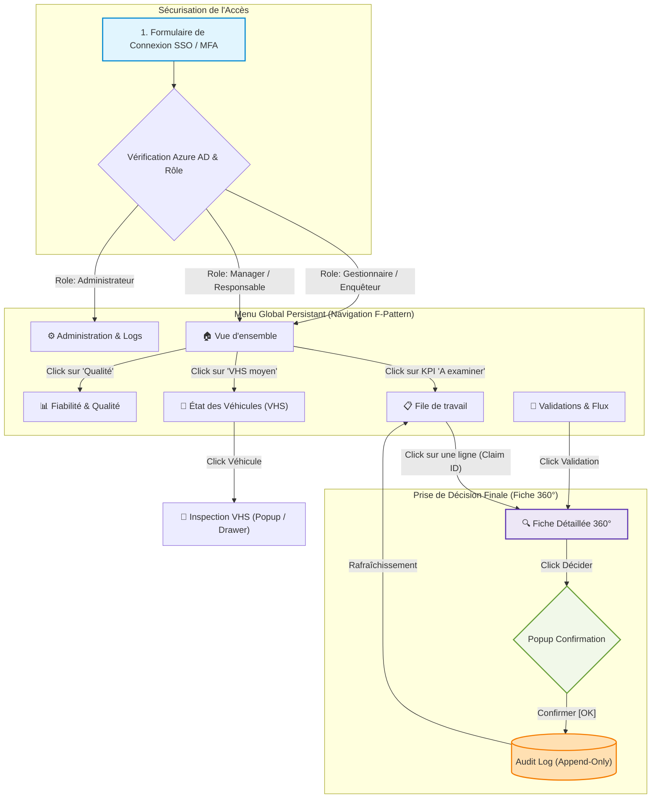

# Rapport UX/UI & Spécifications des Interactions — Plateforme IRIS Auto Fraud

> **Destinataires** : Comité de Soutenance & Équipe de Développement
> **Date de référence** : 22 Juillet 2026
> **Version de spécification** : V2.5 (alignée sur le moteur de score ML V1 Candidate et VHS V4)
> **Statut** : Document de référence pour l'implémentation et la validation UX

---

## 1. Résumé Initial Non-Technique (Executive Summary)

La plateforme décisionnelle **IRIS** a pour but d'éclairer la prise de décision des **gestionnaires sinistres** et des **enquêteurs fraude** de BNA Assurance. Face à un flux annuel impossible à auditer manuellement (~367 000 dossiers), l'intelligence d'IRIS consiste à filtrer et hiérarchiser les dossiers pour soumettre une file de travail réaliste aux experts humains.

IRIS n'est pas un système automatisé de refus de sinistres. L'algorithme calcule un **score d'attention** (de 0 à 100) qui reflète le niveau de suspicion, mais la décision finale (Valider, Rejeter, Compléter) reste exclusivement entre les mains des gestionnaires. 

Pour assurer l'adoption de l'outil par les utilisateurs métiers et la rigueur devant un comité d'audit, la plateforme repose sur trois piliers :
1. **L'explicabilité immédiate** : Pour chaque dossier scoré, l'utilisateur voit en clair les motifs (incohérences de délais, anomalies de montants, historique du client, état mécanique du véhicule).
2. **Une traçabilité absolue (Append-Only)** : Aucune décision humaine n'est jamais écrasée. Si un gestionnaire corrige sa décision, l'historique conserve l'ancienne et la nouvelle valeur avec horodatage et identifiant de l'auteur.
3. **Une sécurité intégrée** : Par le biais du Row-Level Security (RLS), chaque agent ne voit que les données qui le concernent (selon son périmètre régional ou métier), préservant la confidentialité des assurés.

---

## 2. Architecture de Navigation Globale (Role-Aware)

La plateforme adapte son architecture d'information selon le rôle de l'utilisateur connecté afin de respecter le principe de charge cognitive minimale (*Loi de Hick*) et de se concentrer sur les tâches prioritaires.

### Rôles Utilisateurs & Droits d'Accès aux Pages
- **Gestionnaire sinistres (Agent)** : Accès au Dashboard (simplifié), à la File de travail (filtrée sur son périmètre régional), à la Sante des véhicules (VHS) et aux Fiches détaillées.
- **Enquêteur fraude (Expert)** : Accès complet à tous les dossiers prioritaires au niveau national, à l'historique client et à la Fiche détaillée avec signaux ML avancés.
- **Superviseur / Responsable** : Accès au Dashboard de pilotage (exposition financière globale, performance de l'équipe) et au flux global des validations de l'équipe.
- **Administrateur BI / Système** : Accès complet sans restrictions RLS, page d'Audit, journalisation brute, gestion des versions de scoring et alertes sur l'intégrité des tables.

### Diagramme de Navigation de la Plateforme (Mermaid)



---

## 3. Parcours Utilisateur Pas-à-Pas (Login to Action)

### Étape 1 : Connexion et Authentification
- **URL** : `/login` (Géré par [login-page.component.ts](file:///c:/Users/wiem/Downloads/Projet%20PFE/IRIS_AUTO_FRAUD/frontend/src/app/features/auth/login-page.component.ts) et [login-page.component.html](file:///c:/Users/wiem/Downloads/Projet%20PFE/IRIS_AUTO_FRAUD/frontend/src/app/features/auth/login-page.component.html)).
- **Action de l'utilisateur** :
  1. L'utilisateur saisit son adresse e-mail. L'application vérifie en temps réel (via `isBnaEmail`) que le domaine est `@bnaassurance.com`. Si ce n'est pas le cas, un message d'erreur rouge apparaît sous le champ de saisie : *"Utilisez votre adresse professionnelle BNA Assurance pour accéder à IRIS."*
  2. L'utilisateur clique sur la carte correspondant à son rôle (Gestionnaire, Responsable, Manager, Administrateur).
  3. L'utilisateur clique sur **Entrer dans IRIS**.
- **Comportement système** : Le bouton est grisé tant que l'e-mail n'est pas valide. Une fois cliqué, l'application appelle le service d'authentification ([auth.service.ts](file:///c:/Users/wiem/Downloads/Projet%20PFE/IRIS_AUTO_FRAUD/frontend/src/app/core/auth/auth.service.ts)) pour récupérer le profil utilisateur, configure les règles RLS correspondantes, et le redirige vers sa page d'accueil par défaut (le Dashboard).

---

### Étape 2 : Consultation du Tableau de Bord (Vue d'ensemble)
- **URL** : `/app/dashboard` (Géré par [dashboard-page.component.ts](file:///c:/Users/wiem/Downloads/Projet%20PFE/IRIS_AUTO_FRAUD/frontend/src/app/features/dashboard/dashboard-page/dashboard-page.component.ts) et [dashboard-page.component.html](file:///c:/Users/wiem/Downloads/Projet%20PFE/IRIS_AUTO_FRAUD/frontend/src/app/features/dashboard/dashboard-page/dashboard-page.component.html)).
- **Organisation Visuelle (Scanning en F)** :
  - **Ligne supérieure (Top Row)** : 4 cartes KPI colorées résumant la charge du jour (ex: *Dossiers à examiner*, *Expositions financières*, *Taux de confiance*).
  - **Panneau de gauche (60% de largeur)** : Graphiques de tendance ou répartition par garantie.
  - **Panneau de droite (40% de largeur)** : Triage par niveau d'attention (Stacked Chart) et motifs d'incohérence fréquents.
  - **Bas de page** : Liste des dossiers les plus prioritaires pour un accès rapide.
- **Processus de clic & Cibles** :
  - **Click sur la carte KPI "Dossiers à examiner"** ou **"Examen prioritaire"** : Redirige instantanément vers la File de travail (`/app/claims`) en appliquant automatiquement le filtre d'attention correspondant.
  - **Hover (survol) sur le graphique Stacked d'attention** : Affiche une info-bulle (Tooltip) contenant la part en % et le volume exact pour chaque tranche de score (ex: *"Examen prioritaire : 752 dossiers, 0.20%"*).
  - **Click sur un dossier de la liste "Accès rapide"** : Ouvre directement la Fiche détaillée du dossier concerné (`/app/claims/:claimSk`).

---

### Étape 3 : Gestion de la File de Travail (Worklist)
- **URL** : `/app/claims` (Géré par [worklist-page.component.ts](file:///c:/Users/wiem/Downloads/Projet%20PFE/IRIS_AUTO_FRAUD/frontend/src/app/features/worklist/worklist-page/worklist-page.component.ts) et [worklist-page.component.html](file:///c:/Users/wiem/Downloads/Projet%20PFE/IRIS_AUTO_FRAUD/frontend/src/app/features/worklist/worklist-page/worklist-page.component.html)).
- **Actions de filtrage et navigation** :
  - **Boutons de Triage Rapide (Triage Chips)** : Une barre horizontale contenant les filtres pré-calculés : *Tous*, *Prioritaire*, *Renforcé*, *Points à vérifier*, *Standard*. Cliquer sur une puce met instantanément à jour la liste sous-jacente sans rechargement de page.
  - **Filtres Avancés** : Panneau rétractable contenant la recherche textuelle (recherche par N° de dossier, assuré ou véhicule), le filtre de niveau de confiance (High, Medium, Low), et le statut de la décision humaine (Non revu, Conforme, Suspicion confirmée, À compléter).
- **Processus de clic sur la Table de travail** :
  - Cliquer sur le nom d'une colonne (ex: *Score d'attention*, *Montant*) trie les données par ordre croissant/décroissant.
  - Cliquer sur le N° de dossier (ex: `DOSSIER-4091`) déclenche la navigation vers la Fiche détaillée.

---

### Étape 4 : Examen Unitaire du Dossier (Fiche détaillée 360°)
- **URL** : `/app/claims/:claimSk` (Géré par [claim-detail-page.component.ts](file:///c:/Users/wiem/Downloads/Projet%20PFE/IRIS_AUTO_FRAUD/frontend/src/app/features/claim-detail/claim-detail-page.component.ts) et [claim-detail-page.component.html](file:///c:/Users/wiem/Downloads/Projet%20PFE/IRIS_AUTO_FRAUD/frontend/src/app/features/claim-detail/claim-detail-page.component.html)).
- **Processus d'analyse (Éléments UI et Clics associés)** :
  1. **Lecture du Score et de la Confiance** : En haut à gauche, la jauge circulaire indique le score d'attention (ex: `83/100`). Un badge coloré indique si le niveau de confiance dans les données est élevé (*HIGH*), moyen (*MEDIUM*) ou limité (*LOW*).
  2. **Exploration des Blocs 360°** :
     - **Client 360** : Affiche l'ancienneté du contrat, le nombre de sinistres déclarés en 24 mois.
     - **Véhicule 360** : Kilométrage, marque/modèle et score de santé VHS.
     - **Chronologie** : Une frise verticale montre le déroulement temporel du dossier. Un indicateur de délai suspect (ex: *Sinistre déclaré 2 jours après la souscription du contrat*) s'affiche en rouge.
  3. **Vérification des Motifs (Scoring & Signaux)** :
     - Les signaux sont regroupés par famille (ex: *Délais*, *Montants*, *Historique*).
     - Cliquer sur une famille de signaux déroule la liste des règles métier enfreintes avec le nombre de points attribués (ex: *Montant du sinistre supérieur à la moyenne régionale : +15 points*).
  4. **Consultation de l'Analyse ML Anomaly** :
     - Le bloc affiche le score de déviation (ex: *"Plus atypique que 95% des dossiers comparables"*).
     - Il liste les 3 variables majeures ayant provoqué l'anomalie statistique.
  5. **Vérification de la santé mécanique (VHS Popup)** :
     - Si le véhicule a fait l'objet d'une inspection, cliquer sur **"Voir l'inspection VHS"** ouvre une fenêtre modale détaillée (voir section 5).
  6. **Formulaire d'Action Métier (Triage final)** :
     - L'utilisateur sélectionne l'une des 3 décisions possibles :
       - **Suspicion confirmée** (dossier envoyé en enquête approfondie).
       - **Dossier conforme** (le dossier réintègre le flux de règlement normal).
       - **À compléter** (des justificatifs ou rapports d'expert sont attendus).
     - Saisie d'un commentaire justificatif obligatoire si la décision dévie de la recommandation de l'algorithme.
     - Clic sur **Enregistrer la décision** : ouvre une modale de confirmation.

---

### Étape 5 : Analyse Technico-Mécanique (Santé Véhicule - VHS)
- **URL** : `/app/vehicle` (Géré par [vhs-page.component.ts](file:///c:/Users/wiem/Downloads/Projet%20PFE/IRIS_AUTO_FRAUD/frontend/src/app/features/vehicle/vhs-page.component.ts) et [vhs-page.component.html](file:///c:/Users/wiem/Downloads/Projet%20PFE/IRIS_AUTO_FRAUD/frontend/src/app/features/vehicle/vhs-page.component.html)).
- **Objectif** : Permettre à l'enquêteur fraude de croiser l'état mécanique d'un véhicule déclaré sinistré avec ses observations physiques.
- **Processus de clic** :
  - **Filtres par décision** : L'enquêteur clique sur les puces d'état (*Tous*, *Bon état*, *État dégradé*, *État critique*, *Immobilisé*) pour filtrer le parc de véhicules.
  - **Click sur une ligne de véhicule** : Déroule un volet interne (accordéon) qui charge en temps réel le rapport d'inspection complet :
    - Détail des pièces par zone (Tour du véhicule, Sous le capot, Sous le véhicule, Intérieur, Entretien).
    - Nombre exact de points de pénalité appliqués par pièce défaillante (ex: *Usure prononcée des disques de frein : -10 points*).

---

## 4. Layouts et Zonage des Pages Principales

### 4.1 Page "Vue d'ensemble" (Dashboard de pilotage)
```
+-----------------------------------------------------------------------------+
|  [Logo IRIS]  BNA Assurance - Espace Décisionnel          [User Info] [Out] |
+-----------------------------------------------------------------------------+
|  Filtres Globaux : [ Période Temporelle ] [ Région/Agence ] [ Garantie ]    |
+-----------------------------------------------------------------------------+
|  +--------------------+ +--------------------+ +--------------------+       |
|  | KPI : Total Claims | | KPI : Taux Haute   | | KPI : Exposition   |       |
|  | 367 464            | | Attention : 0.20%  | | Totale : 711M TND  |       |
|  +--------------------+ +--------------------+ +--------------------+       |
|                                                                             |
|  +-------------------------------------+ +--------------------------------+ |
|  | Graphique Tendance Courbe (12 mois)  | | Répartition Attention          | |
|  | Volume mensuel & part prioritaire     | | [====] Prioritaire (0.2%)      | |
|  |                                     | | [======] Renforcé (4.0%)       | |
|  +-------------------------------------+ +--------------------------------+ |
|                                                                             |
|  +-------------------------------------+ +--------------------------------+ |
|  | Top 5 Garanties (Pareto)            | | Qualité des Données            | |
|  | Volume par type de couverture       | | 80.2% High Confidence          | |
|  +-------------------------------------+ +--------------------------------+ |
+-----------------------------------------------------------------------------+
| Réf: Version Moteur Score V1.3 - Données rafraîchies le 22/07/2026 à 08h00 |
+-----------------------------------------------------------------------------+
```

### 4.2 Page "Fiche Détaillée 360°" (claim-detail)
```
+-----------------------------------------------------------------------------+
|  [<- Retour à la file] Dossier N° DOSSIER-4091        Assigné à : Agent X   |
+-----------------------------------------------------------------------------+
| +------------------------------------+ +----------------------------------+ |
| | BLOC 360° CLIENT & CONTRAT         | | BLOC SCORING & ANOMALIES ML      | |
| | - Assuré: Nom Prénom (Ancien: 9 ans)| | - Score final d'attention : 83  | |
| | - Contrat: Tous Risques (depuis 17)| | - Niveau : Examen Prioritaire    | |
| | - Sinistres 24m: 3                 | | - Confiance : HIGH (Données OK)  | |
| +------------------------------------+ |                                  | |
| +------------------------------------+ | - ML: Plus atypique que 95%      | |
| | BLOC VÉHICULE & INSPECTION         | |   Drivers:                       | |
| | - Peugeot 208 (2019) immat: 123TN  | |   * Nombre sinistres 12m         | |
| | - Score de santé mécanique: 58/100 | |   * Montant vs Médiane Garantie  | |
| |   [Bouton: Voir Inspection VHS]    | +----------------------------------+ |
| +------------------------------------+ +----------------------------------+ |
| +------------------------------------+ +----------------------------------+ |
| | CHRONOLOGIE DU DOSSIER (TIMELINE)  | | MOTIFS EXPLICATIFS (SIGNALS)     | |
| | (o) Contrat souscrit               | | [+] Délais et chronologie (+30p) | |
| |  |  150 jours                      | | [+] Écart de montant (+15p)      | |
| | (o) Véhicule inspecté              | | [+] Historique Assuré (+10p)     | |
| |  |  2 jours (DÉLAI SUSPECT ROUGE)  | |                                  | |
| | (o) Sinistre déclaré               | +----------------------------------+ |
| +------------------------------------+ +----------------------------------+ |
| +-------------------------------------------------------------------------+ |
| | FORMULAIRE DE DÉCISION                                                 | |
| | Choix : [ Suspicion Confirmée ]  [ Dossier Conforme ]  [ À Compléter ]  | |
| | Commentaire : [_______________________________________________________] | |
| | [ Enregistrer la décision ]                                             | |
| +-------------------------------------------------------------------------+ |
+-----------------------------------------------------------------------------+
```

---

## 5. Interactions, Popups et Gestion du Feedback

La clarté de l'interface repose sur des retours visuels instantanés (feedback) pour éviter toute erreur de manipulation de la part de l'expert fraude.

### 5.1 Modales de Confirmation (Actions Métier)
- **Déclencheur** : L'utilisateur clique sur le bouton **Enregistrer la décision** après avoir choisi un statut de revue.
- **Apparence** : Fenêtre modale centrée bloquant le reste de l'écran avec un arrière-plan assombri (Overlay).
- **Contenu textuel** :
  > **Confirmer l'enregistrement de la décision**
  >
  > Vous êtes sur le point de marquer le dossier **DOSSIER-4091** comme **[Suspicion Confirmée]**.
  > Cette action sera définitivement enregistrée dans le journal d'audit de BNA Assurance.
  >
  > *Commentaire saisi* : "Incohérence majeure constatée entre la date d'inspection technique et la déclaration du sinistre (2 jours d'écart)."
  >
  > [ Annuler ]  **[ Confirmer et Enregistrer ]**
- **Action de clic** :
  - **Annuler** : Ferme la modale sans effet.
  - **Confirmer** : Envoie la requête HTTP POST à l'API (`/api/decisions`), ferme la modale, affiche un toast de succès vert pendant 3 secondes (*"Décision enregistrée avec succès"*), et actualise la file de travail.

### 5.2 Fenêtre Modale de Santé du Véhicule (VHS Inspection Detail)
- **Déclencheur** : Dans la Fiche détaillée 360°, clic sur le bouton **Voir l'inspection VHS**.
- **Comportement** :
  1. Affiche un indicateur de chargement rotatif (Spinner) pendant l'appel API.
  2. Une fois chargé, affiche une vue complète des 5 zones d'inspection mécanique.
  3. Chaque anomalie est repérée par un tag coloré selon sa gravité (*CRITIQUE* en rouge, *USURE PRONONCÉE* en orange, *OK* en vert).
  4. Si le score final du véhicule est égal à 0 et que la pénalité cumulée dépasse 100 points, un bandeau d'information s'affiche :
     > **🚨 Échelle saturée (Score VHS = 0)**
     > Les pénalités cumulées de ce véhicule s'élèvent à **142 points**, dépassant le maximum de l'échelle. L'état mécanique général correspond à une épave ou un véhicule non roulant.
  5. Clic sur le bouton **Fermer [X]** ou appui sur la touche `Échap` ferme la modale.

### 5.3 Bandeaux d'Alerte et Messages d'Erreur (Banner Alerts)
- **Alerte Qualité des Données** : Si le taux d'anomalies de données sur les contrats importés dépasse 5% dans la vue en cours, un bandeau orange persistant apparaît en haut de la page :
  > ⚠️ **Anomalie de synchronisation du DWH** : 5.8% des dossiers de sinistres actifs présentent des clés de dimensions orphelines (clients inconnus). L'indice de confiance global est dégradé.
- **Message d'Erreur API** : Si le serveur backend ne répond pas lors du chargement de la file de travail, la table de données est remplacée par un bloc d'alerte rouge :
  > ❌ **Service indisponible** : La file de travail est momentanément inaccessible. Nos équipes techniques ont été alertées. Veuillez réessayer dans quelques minutes.

### 5.4 Raccourcis Clavier Globalement Supportés
- `Tab` / `Maj + Tab` : Naviguer entre les boutons, filtres et cartes KPI sans souris (focus matérialisé par une bordure bleue contrastée).
- `Entrée` : Activer l'élément ou la ligne de dossier en focus.
- `Échap` : Fermer instantanément n'importe quel popup ou modale ouverte (Fiche détaillée, VHS detail).
- `Ctrl + E` : Ouvrir directement le menu d'export de données (PDF / CSV).
- `F4` : Forcer le rafraîchissement manuel de la page active et des requêtes API sous-jacentes.

---

## 6. Annexes Techniques (Sécurité, Traçabilité & Architecture)

### 6.1 Authentification SSO Microsoft Entra ID + MFA
L'authentification s'appuie sur le protocole **OAuth 2.0 / OpenID Connect** configuré sur l'instance Entra ID de BNA Assurance.
1. **Flow d'authentification** : Lors du clic sur "Entrer dans IRIS", si la session est expirée, l'utilisateur est redirigé vers le portail de connexion Microsoft BNA.
2. **Double Facteur (MFA)** : Après validation du mot de passe entreprise, l'utilisateur doit approuver la connexion sur son application mobile *Microsoft Authenticator* (ou saisir un code SMS à usage unique).
3. **Retour de Token (JWT)** : L'application récupère un JSON Web Token chiffré contenant les claims de l'utilisateur (`email`, `roles`, `region`). Ce token est transmis dans l'en-tête de chaque requête API backend sous le format `Authorization: Bearer <token>`.

### 6.2 Row-Level Security (RLS) Dynamique
Le filtrage des données s'applique de manière stricte au niveau de la base de données PostgreSQL et du rapport Power BI :
- **Dans Power BI** : Une règle RLS utilise la fonction `USERPRINCIPALNAME()` qui récupère l'adresse email de la session Entra ID. Cette adresse est jointe à la dimension `dim_intermediaire` ou `dim_geo` pour restreindre les lignes de faits.
  ```dax
  // Exemple de filtre RLS appliqué sur la table fact_sinistre
  'fact_sinistre'[region_label] = 
      LOOKUPVALUE('dim_user_regions'[region_label], 
                  'dim_user_regions'[user_email], 
                  USERPRINCIPALNAME())
  ```
- **Dans l'API Flask** : Les requêtes SQL injectent dynamiquement le paramètre `:user_email` dans les clauses `WHERE` pour s'assurer qu'aucun utilisateur ne puisse interroger un ID de dossier hors de son périmètre régional.

### 6.3 Traçabilité Absolue : Implémentation Append-Only
Pour satisfaire aux exigences réglementaires et de conformité, toute décision prise sur la plateforme IRIS est historisée.
- **Modèle relationnel** : La table d'écriture [claim_review_decision](file:///c:/Users/wiem/Downloads/Projet%20PFE/IRIS_AUTO_FRAUD/backend/migrations/001_create_claim_review_decision.py#L36) stocke chaque soumission.
- **Lien de Correction** : Si un gestionnaire souhaite modifier une décision précédente, la nouvelle ligne pointe sur l'ancienne via le champ `corrects_decision_id`.
- **Garantie au Niveau SQL (Trigger d'Intégrité)** :
  Pour interdire structurellement toute modification (UPDATE) ou suppression (DELETE), le trigger PostgreSQL suivant est activé sur la base de production :
  ```sql
  -- Fonction de blocage
  CREATE OR REPLACE FUNCTION app.prevent_claim_review_decision_mutation()
  RETURNS TRIGGER AS $$
  BEGIN
      RAISE EXCEPTION 'app.claim_review_decision est strict-append-only : les modifications et suppressions sont interdites pour des raisons de conformité.';
  END;
  $$ LANGUAGE plpgsql;

  -- Liaison du trigger
  CREATE TRIGGER trg_prevent_claim_review_decision_mutation
  BEFORE UPDATE OR DELETE ON app.claim_review_decision
  FOR EACH ROW EXECUTE FUNCTION app.prevent_claim_review_decision_mutation();
  ```

### 6.4 Exportations de Données (Sécurité & Conformité GDPR/SOX)
- **Contrôle d'accès** : L'accès à l'exportation (bouton CSV/PDF) est réservé aux rôles *Enquêteur*, *Manager* et *Administrateur*. Le rôle *Gestionnaire sinistres* ne peut pas exporter de données en local.
- **Marquage (Watermark)** : Tout fichier PDF généré applique un filigrane contenant : *l'adresse e-mail de l'opérateur*, *l'adresse IP de la session*, et *l'horodatage exact de l'extraction*.
- **Journalisation de l'export** : Une entrée est immédiatement enregistrée dans la table d'audit système à chaque clic d'exportation :
  ```
  [2026-07-22 11:04:12] USER: manager.expert@bnaassurance.com | ACTION: DATA_EXPORT | TARGET: claims_priority_list.csv | ROWS: 752 | IP: 192.168.12.45
  ```

### 6.5 Gouvernance et Versioning des Modèles de Score
Chaque modification apportée au moteur de notation (mises à jour des règles métiers, ré-entraînement du modèle Isolation Forest ML) génère une nouvelle version dans la table `mart.fact_claim_attention_score`.
- L'identifiant unique `score_run_id` (ex: `IRIS_CLAIM_ATTENTION_HYBRID_ML_V1_CANDIDATE_20260713_222301`) associe chaque score à son historique exact de calcul.
- L'utilisateur peut à tout moment filtrer la file de travail sur un run antérieur pour comparer ou justifier une décision prise sous une ancienne version du moteur, garantissant une explicabilité rétroactive complète.

---
*Ce document sert de spécification fonctionnelle et technique officielle pour la livraison de la plateforme décisionnelle IRIS.*
