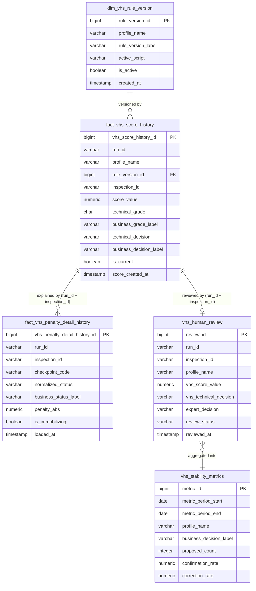

# Design technique des tables de gouvernance VHS

> **Statut :** Document de conception — tables proposées, non encore implémentées  
> **Version :** 1.0 — 2026-07-04  
> **Référence :** `docs/vhs/governance/vhs_human_in_the_loop_and_history_architecture.md`  
> **Destinataires :** Jury académique, équipes techniques BNA Assurances, future équipe de production

---

## 1. Objectif du document

Ce document traduit l'architecture de gouvernance VHS décrite dans le document de référence en une conception technique détaillée des tables de données.

Les tables décrites ci-dessous constituent des **structures proposées** dans le cadre de la Phase 2 de la feuille de route de gouvernance. Elles ont pour vocation de :

- Préparer une implémentation propre et auditable de la couche d'historisation
- Définir précisément les colonnes, types, contraintes et indexes nécessaires
- Établir les règles de chargement et de mise à jour des données
- Servir de référence technique pour la rédaction future du script DDL

Le moteur VHS déterministe (`etl/mart/compute_vhs_v3_candidate.py`) n'est pas modifié par ce document. La conception supporte l'historisation, la revue humaine, l'auditabilité et la surveillance de la stabilité métier.

> **Ce document décrit les structures proposées ; il ne constitue pas une migration de base de données exécutée.**

---

## 2. Principes de conception

La conception des tables de gouvernance repose sur les principes suivants :

| Principe | Description |
|----------|-------------|
| **Append-only pour l'historique** | Les tables `fact_vhs_score_history` et `fact_vhs_penalty_detail_history` ne sont jamais mises à jour après insertion. Chaque run ajoute de nouvelles lignes. |
| **Pas d'écrasement des résultats historiques** | Un score calculé à une date donnée ne peut être ni modifié ni supprimé. L'historique est immuable. |
| **Versionnage explicite des règles** | Toute modification du moteur VHS doit être enregistrée dans `dim_vhs_rule_version` avant l'exécution d'un nouveau run. |
| **Séparation score calculé / revue humaine** | La table `vhs_human_review` n'écrase jamais le score VHS original. Elle stocke la réponse de l'expert à côté du score. |
| **Labels métier stockés avec les codes techniques** | Les libellés lisibles (`business_decision_label`, `business_status_label`) sont persistés directement, sans jointure obligatoire à la lecture. |
| **Traçabilité par run_id et inspection_id** | Toute ligne de données peut être reliée à son run d'origine et à l'inspection concernée. |
| **Flag is_current pour la commodité, pas pour la suppression** | `is_current = false` ne supprime pas les lignes historiques ; il identifie simplement la version la plus récente. |
| **Dataset ML dérivé uniquement des données revues** | Aucun futur modèle supervisé ne doit utiliser des scores VHS sans revue humaine associée comme label d'entraînement. |

---

## 3. Table : `mart.dim_vhs_rule_version`

### 3.1 Objet

Référentiel des versions de règles VHS. Chaque ligne correspond à un profil de calcul versionnisé. Toute modification du moteur VHS doit donner lieu à une nouvelle entrée avant d'être exécutée en production.

### 3.2 Définition des colonnes

| Colonne | Type suggéré | Nullable | Clé | Description |
|---------|-------------|----------|-----|-------------|
| `rule_version_id` | `BIGINT` | NOT NULL | PK | Identifiant technique unique |
| `profile_name` | `VARCHAR(100)` | NOT NULL | — | Nom du profil (ex. `VHS_BALANCED_V3_CANDIDATE`) |
| `rule_version_label` | `VARCHAR(150)` | NOT NULL | — | Libellé lisible de la version |
| `active_script` | `VARCHAR(255)` | NOT NULL | — | Chemin du script de calcul actif |
| `description` | `TEXT` | NULL | — | Description des changements introduits |
| `created_at` | `TIMESTAMP` | NOT NULL | — | Date d'enregistrement de la version |
| `created_by` | `VARCHAR(100)` | NULL | — | Auteur ou système ayant créé la version |
| `is_active` | `BOOLEAN` | NOT NULL | — | Version couramment active pour ce profil |
| `notes` | `TEXT` | NULL | — | Notes complémentaires, références, tickets |

### 3.3 Contraintes fonctionnelles

- `profile_name` doit être unique pour toute version ayant `is_active = true`.
- Une seule ligne par `profile_name` peut avoir `is_active = true` à un instant donné.
- `active_script` doit pointer vers un script VHS connu et versionné.
- Toute modification de la logique de scoring exige la création d'une nouvelle entrée (pas de mise à jour de lignes existantes).

### 3.4 Index recommandés

```
idx_dim_vhs_rule_version_profile_name  ON (profile_name)
idx_dim_vhs_rule_version_is_active     ON (is_active)
```

### 3.5 Exemple de valeur initiale (seed)

| Colonne | Valeur |
|---------|--------|
| `profile_name` | `VHS_BALANCED_V3_CANDIDATE` |
| `rule_version_label` | `V3 candidate finale — correction Usage déconseillé` |
| `active_script` | `etl/mart/compute_vhs_v3_candidate.py` |
| `description` | `Correctif IMMOBILISE : exige is_immobilizing=TRUE ET observed_status=BROKEN. Réduction 25 → 13 cas.` |
| `is_active` | `true` |
| `created_by` | `iris_etl_team` |

---

## 4. Table : `mart.fact_vhs_score_history`

### 4.1 Objet

Table de faits en append-only stockant chaque score VHS calculé par run et inspection. C'est la source de vérité historique des propositions VHS.

### 4.2 Définition des colonnes

| Colonne | Type suggéré | Nullable | Clé | Description |
|---------|-------------|----------|-----|-------------|
| `vhs_score_history_id` | `BIGINT` | NOT NULL | PK | Identifiant technique unique |
| `run_id` | `VARCHAR(120)` | NOT NULL | — | Identifiant du run VHS d'origine |
| `profile_name` | `VARCHAR(100)` | NOT NULL | — | Profil utilisé |
| `rule_version_id` | `BIGINT` | NULL | FK → `dim_vhs_rule_version` | Version de règles associée |
| `inspection_id` | `VARCHAR(120)` | NOT NULL | — | Identifiant de l'inspection STAFFIM |
| `vehicle_key` | `VARCHAR(120)` | NULL | — | Clé du véhicule (anonymisée si nécessaire) |
| `score_value` | `NUMERIC(5,2)` | NOT NULL | — | Score VHS calculé [0.00 – 100.00] |
| `technical_grade` | `CHAR(1)` | NOT NULL | — | Note technique (A / B / C / D) |
| `business_grade_label` | `VARCHAR(100)` | NOT NULL | — | Libellé métier de la note |
| `technical_decision` | `VARCHAR(30)` | NOT NULL | — | Décision technique (OK / DEGRADE / IMMOBILISE / CRITIQUE) |
| `business_decision_label` | `VARCHAR(100)` | NOT NULL | — | Libellé métier de la décision |
| `score_created_at` | `TIMESTAMP` | NOT NULL | — | Horodatage du calcul dans le run |
| `loaded_at` | `TIMESTAMP` | NOT NULL | — | Horodatage de l'insertion dans cette table |
| `is_current` | `BOOLEAN` | NOT NULL | — | `true` = score le plus récent pour cette inspection/profil |

### 4.3 Contraintes

| Contrainte | Règle |
|------------|-------|
| Score valide | `score_value BETWEEN 0 AND 100` |
| Note technique valide | `technical_grade IN ('A', 'B', 'C', 'D')` |
| Décision technique valide | `technical_decision IN ('OK', 'DEGRADE', 'IMMOBILISE', 'CRITIQUE')` |
| Libellé métier valide | `business_decision_label IN ('État satisfaisant', 'État à surveiller', 'Usage déconseillé', 'Examen prioritaire suggéré')` |
| Unicité par run | `UNIQUE (run_id, inspection_id, profile_name)` |
| Un seul courant | Un seul `is_current = true` par `(inspection_id, profile_name)` |

### 4.4 Index recommandés

```
idx_vhs_score_history_inspection   ON (inspection_id)
idx_vhs_score_history_run          ON (run_id)
idx_vhs_score_history_current      ON (is_current) WHERE is_current = true
idx_vhs_score_history_decision     ON (technical_decision)
idx_vhs_score_history_created_at   ON (score_created_at)
```

### 4.5 Règles de chargement

1. **Insertion append-only** : chaque run ajoute de nouvelles lignes sans modifier les lignes existantes.
2. **Mise à jour du flag courant** : avant d'insérer un nouveau score courant pour une même `(inspection_id, profile_name)`, passer `is_current = false` sur la ligne précédente.
3. **Jamais de suppression** : les lignes historiques ne sont jamais supprimées.
4. **Auditabilité** : toute ligne doit être traçable vers son `run_id` et sa `rule_version_id`.

---

## 5. Table : `mart.fact_vhs_penalty_detail_history`

### 5.1 Objet

Table de faits en append-only stockant l'explication checkpoint par checkpoint de chaque score. Elle répond à la question : « Pourquoi le score a-t-il diminué sur ce point de contrôle ? »

### 5.2 Définition des colonnes

| Colonne | Type suggéré | Nullable | Clé | Description |
|---------|-------------|----------|-----|-------------|
| `vhs_penalty_detail_history_id` | `BIGINT` | NOT NULL | PK | Identifiant technique unique |
| `run_id` | `VARCHAR(120)` | NOT NULL | — | Identifiant du run d'origine |
| `profile_name` | `VARCHAR(100)` | NOT NULL | — | Profil utilisé |
| `inspection_id` | `VARCHAR(120)` | NOT NULL | — | Identifiant de l'inspection |
| `checkpoint_code` | `VARCHAR(150)` | NOT NULL | — | Code STAFFIM du point de contrôle |
| `checkpoint_label` | `VARCHAR(255)` | NULL | — | Libellé lisible du point de contrôle |
| `raw_value` | `VARCHAR(255)` | NULL | — | Valeur brute observée lors de l'inspection |
| `normalized_status` | `VARCHAR(50)` | NOT NULL | — | Statut normalisé VHS |
| `business_status_label` | `VARCHAR(100)` | NOT NULL | — | Libellé métier du statut |
| `penalty_value` | `NUMERIC(8,2)` | NOT NULL | — | Pénalité appliquée (peut être négative) |
| `penalty_abs` | `NUMERIC(8,2)` | NOT NULL | — | Valeur absolue de la pénalité |
| `tier` | `VARCHAR(50)` | NULL | — | Niveau de sévérité du checkpoint |
| `is_immobilizing` | `BOOLEAN` | NULL | — | Point de contrôle immobilisant selon dim_checkpoint |
| `is_critical_functional` | `BOOLEAN` | NULL | — | Point de contrôle fonctionnel critique |
| `loaded_at` | `TIMESTAMP` | NOT NULL | — | Horodatage de l'insertion |

### 5.3 Contraintes

| Contrainte | Règle |
|------------|-------|
| Statut normalisé valide | `normalized_status IN ('OK', 'WORN', 'WORN_STRONG', 'BROKEN', 'REPAIRED', 'UNKNOWN')` |
| Pénalité absolue positive | `penalty_abs >= 0` |
| Libellé métier valide | `business_status_label IN ('Élément conforme', 'Usure observée', 'Intervention conseillée', 'Défaut confirmé', 'Élément réparé', 'Information non exploitable')` |
| Unicité par run | `UNIQUE (run_id, inspection_id, checkpoint_code)` |

### 5.4 Correspondance statuts normalisés — libellés métier

| `normalized_status` | `business_status_label` |
|---------------------|------------------------|
| `OK` | Élément conforme |
| `WORN` | Usure observée |
| `WORN_STRONG` | Intervention conseillée |
| `BROKEN` | Défaut confirmé |
| `REPAIRED` | Élément réparé |
| `UNKNOWN` | Information non exploitable |

### 5.5 Index recommandés

```
idx_vhs_penalty_history_inspection   ON (inspection_id)
idx_vhs_penalty_history_run          ON (run_id)
idx_vhs_penalty_history_status       ON (normalized_status)
idx_vhs_penalty_history_penalty_abs  ON (penalty_abs DESC)
idx_vhs_penalty_history_immobilizing ON (is_immobilizing) WHERE is_immobilizing = true
```

### 5.6 Règles de chargement

1. **Insertion append-only** : chaque run ajoute les lignes de détail sans modifier l'historique existant.
2. **Conservation intégrale** : l'intégralité des détails checkpoint est conservée pour auditabilité.
3. **Dérivation du label métier** : `business_status_label` doit être calculé à partir du mapping officiel VHS avant insertion.
4. **Applications métier** : les interfaces utilisateurs doivent afficher `business_status_label`, jamais `normalized_status`.

---

## 6. Table : `mart.vhs_human_review`

### 6.1 Objet

Table de workflow stockant la décision du gestionnaire, de l'expert ou du superviseur en réponse à une proposition VHS. La revue humaine **ne modifie jamais** le score VHS original.

### 6.2 Définition des colonnes

| Colonne | Type suggéré | Nullable | Clé | Description |
|---------|-------------|----------|-----|-------------|
| `review_id` | `BIGINT` | NOT NULL | PK | Identifiant unique de revue |
| `run_id` | `VARCHAR(120)` | NOT NULL | — | Run ayant produit le score à réviser |
| `profile_name` | `VARCHAR(100)` | NOT NULL | — | Profil VHS concerné |
| `inspection_id` | `VARCHAR(120)` | NOT NULL | — | Inspection concernée |
| `vhs_score_value` | `NUMERIC(5,2)` | NOT NULL | — | Score VHS proposé (copie immuable) |
| `vhs_technical_decision` | `VARCHAR(30)` | NOT NULL | — | Décision technique proposée par VHS |
| `vhs_business_label` | `VARCHAR(100)` | NOT NULL | — | Libellé métier proposé par VHS |
| `expert_decision` | `VARCHAR(30)` | NULL | — | Décision retenue par l'expert |
| `expert_decision_label` | `VARCHAR(100)` | NULL | — | Libellé métier de la décision retenue |
| `review_status` | `VARCHAR(30)` | NOT NULL | — | Statut de la revue |
| `reviewer_role` | `VARCHAR(50)` | NULL | — | Rôle du relecteur (gestionnaire / expert / superviseur) |
| `reviewed_by` | `VARCHAR(120)` | NULL | — | Identifiant de l'utilisateur ayant effectué la revue |
| `reviewed_at` | `TIMESTAMP` | NULL | — | Date et heure de la revue |
| `review_comment` | `TEXT` | NULL | — | Commentaire libre |
| `correction_reason` | `VARCHAR(255)` | NULL | — | Motif de correction si `review_status = CORRECTED` |
| `created_at` | `TIMESTAMP` | NOT NULL | — | Date de création de la ligne |
| `updated_at` | `TIMESTAMP` | NULL | — | Date de dernière mise à jour |

### 6.3 Valeurs autorisées

**`review_status` :**

| Valeur | Description |
|--------|-------------|
| `PENDING` | En attente de revue humaine |
| `CONFIRMED` | Niveau VHS confirmé par l'expert |
| `CORRECTED` | Niveau VHS modifié par l'expert |
| `REJECTED` | Proposition inadaptée au dossier |
| `NEEDS_MORE_INFO` | Information complémentaire demandée |

**`expert_decision` et `expert_decision_label` :**

| `expert_decision` | `expert_decision_label` |
|-------------------|------------------------|
| `OK` | État satisfaisant |
| `DEGRADE` | État à surveiller |
| `IMMOBILISE` | Usage déconseillé |
| `CRITIQUE` | Examen prioritaire suggéré |

### 6.4 Règles de cohérence par statut

| Statut | Règle |
|--------|-------|
| `PENDING` | `expert_decision` et `reviewed_at` peuvent être NULL |
| `CONFIRMED` | `expert_decision` doit être égal à `vhs_technical_decision` ; `reviewed_at` requis |
| `CORRECTED` | `expert_decision` différent de `vhs_technical_decision` ; `correction_reason` NOT NULL ; `reviewed_at` requis |
| `REJECTED` | `review_comment` NOT NULL ; `reviewed_at` requis |
| `NEEDS_MORE_INFO` | `review_comment` NOT NULL recommandé ; `reviewed_at` requis |

### 6.5 Contraintes

```
UNIQUE (run_id, inspection_id, profile_name)
```

### 6.6 Index recommandés

```
idx_vhs_human_review_status       ON (review_status)
idx_vhs_human_review_inspection   ON (inspection_id)
idx_vhs_human_review_reviewer     ON (reviewed_by)
idx_vhs_human_review_reviewed_at  ON (reviewed_at)
idx_vhs_human_review_decision     ON (expert_decision)
```

### 6.7 Règle de création de la file de revue

Lors du chargement d'un nouveau run courant, des lignes `PENDING` peuvent être créées pour toutes les inspections nécessitant une revue. La priorité de traitement recommandée est :

| Priorité | Niveau proposé |
|----------|---------------|
| 1 | Usage déconseillé |
| 2 | Examen prioritaire suggéré |
| 3 | État à surveiller |
| 4 | État satisfaisant |

---

## 7. Table : `mart.vhs_stability_metrics`

### 7.1 Objet

Table d'agrégation calculant les indicateurs de fiabilité métier des propositions VHS sur une période donnée. Les métriques sont dérivées de `vhs_human_review` et ne peuvent exister sans revues enregistrées.

### 7.2 Définition des colonnes

| Colonne | Type suggéré | Nullable | Clé | Description |
|---------|-------------|----------|-----|-------------|
| `metric_id` | `BIGINT` | NOT NULL | PK | Identifiant unique |
| `metric_period_start` | `DATE` | NOT NULL | — | Début de la période analysée |
| `metric_period_end` | `DATE` | NOT NULL | — | Fin de la période analysée |
| `profile_name` | `VARCHAR(100)` | NOT NULL | — | Profil VHS évalué |
| `business_decision_label` | `VARCHAR(100)` | NOT NULL | — | Niveau d'attention analysé |
| `proposed_count` | `INTEGER` | NOT NULL | — | Nombre de propositions sur la période |
| `confirmed_count` | `INTEGER` | NOT NULL | — | Nombre de confirmations |
| `corrected_count` | `INTEGER` | NOT NULL | — | Nombre de corrections |
| `rejected_count` | `INTEGER` | NOT NULL | — | Nombre de rejets |
| `needs_more_info_count` | `INTEGER` | NOT NULL | — | Nombre de demandes d'information |
| `confirmation_rate` | `NUMERIC(6,4)` | NULL | — | Taux de confirmation (0.0000 – 1.0000) |
| `correction_rate` | `NUMERIC(6,4)` | NULL | — | Taux de correction |
| `rejection_rate` | `NUMERIC(6,4)` | NULL | — | Taux de rejet |
| `needs_more_info_rate` | `NUMERIC(6,4)` | NULL | — | Taux de demandes d'information |
| `top_corrected_checkpoint` | `VARCHAR(255)` | NULL | — | Checkpoint le plus souvent à l'origine des corrections |
| `created_at` | `TIMESTAMP` | NOT NULL | — | Date d'insertion de la métrique |

### 7.3 Formules de calcul

```
confirmation_rate     = confirmed_count      / proposed_count  (NULL si proposed_count = 0)
correction_rate       = corrected_count      / proposed_count
rejection_rate        = rejected_count       / proposed_count
needs_more_info_rate  = needs_more_info_count / proposed_count
```

### 7.4 Contraintes

| Contrainte | Règle |
|------------|-------|
| Compteurs positifs | Tous les `*_count >= 0` |
| Cohérence des totaux | `confirmed + corrected + rejected + needs_more_info <= proposed_count` |
| Taux valides | Tous les `*_rate BETWEEN 0 AND 1` (ou NULL si `proposed_count = 0`) |
| Unicité de période | `UNIQUE (metric_period_start, metric_period_end, profile_name, business_decision_label)` |

### 7.5 Index recommandés

```
idx_vhs_stability_period   ON (metric_period_start, metric_period_end)
idx_vhs_stability_profile  ON (profile_name)
idx_vhs_stability_label    ON (business_decision_label)
```

### 7.6 Interprétation métier

| Indicateur | Seuil d'alerte | Action recommandée |
|-----------|---------------|-------------------|
| `confirmation_rate` élevé | > 0.80 | Règles bien calibrées — continuer |
| `correction_rate` élevé | > 0.20 | Revoir les règles VHS avec BNA |
| `needs_more_info_rate` élevé | > 0.15 | Vérifier la qualité des données STAFFIM |
| `correction_rate` pour Usage déconseillé | > 0.20 | Revoir la liste `is_immobilizing` dans `dim_checkpoint` |

---

## 8. Relations entre tables

### 8.1 Diagramme entité-relation



### 8.2 Lecture du modèle

| Relation | Description |
|----------|-------------|
| `dim_vhs_rule_version` → `fact_vhs_score_history` | Un version de règles peut avoir produit plusieurs runs et scores. La clé étrangère `rule_version_id` lie chaque score à sa version de règles. |
| `fact_vhs_score_history` → `fact_vhs_penalty_detail_history` | Un score est expliqué par plusieurs lignes de pénalités checkpoint. La jointure se fait sur `(run_id, inspection_id)`. |
| `fact_vhs_score_history` → `vhs_human_review` | Un score peut faire l'objet d'une revue humaine. La relation est 1:1 par `(run_id, inspection_id, profile_name)`. |
| `vhs_human_review` → `vhs_stability_metrics` | Les métriques de stabilité sont agrégées périodiquement à partir des revues. Il n'y a pas de clé étrangère directe : les métriques sont calculées par batch. |

**Principe fondamental du modèle :**
- `fact_vhs_score_history` est la **vérité calculée** — elle est immuable.
- `vhs_human_review` est la **réponse métier** — elle stocke l'interprétation de l'expert sans altérer le score original.
- `vhs_stability_metrics` est la **vision agrégée** — elle mesure la fiabilité des propositions dans le temps.

---

## 9. Séquence de chargement

La séquence suivante décrit l'ordre d'alimentation recommandé lors de la Phase 2. **Elle est proposée à titre de référence ; elle n'est pas exécutée dans ce document.**

```
Étape 1 — Vérification de la version de règles
    └─ Vérifier ou créer une entrée dans dim_vhs_rule_version
       pour le profil et le script actif.

Étape 2 — Chargement de l'historique des scores
    └─ Insérer toutes les lignes de mart.fact_vhs_score
       dans mart.fact_vhs_score_history (append-only).
       Mettre à jour is_current sur les lignes précédentes.

Étape 3 — Chargement du détail des pénalités
    └─ Insérer toutes les lignes de mart.fact_vhs_penalty_detail
       dans mart.fact_vhs_penalty_detail_history (append-only).
       Calculer business_status_label à partir du mapping officiel.

Étape 4 — Validation de cohérence
    └─ Vérifier l'absence d'orphelins (pénalités sans score).
       Vérifier la cohérence des labels métier.
       Contrôler les valeurs hors contrainte.

Étape 5 — Alimentation de la file de revue
    └─ Créer des lignes PENDING dans vhs_human_review
       pour les scores courants nécessitant une revue.
       Prioriser selon le niveau d'attention (Usage déconseillé en premier).

Étape 6 — Revue humaine (IRIS)
    └─ Les gestionnaires et experts traitent la file dans l'interface IRIS.
       Les statuts PENDING passent à CONFIRMED / CORRECTED / REJECTED / NEEDS_MORE_INFO.

Étape 7 — Calcul des métriques de stabilité (batch périodique)
    └─ Agréger vhs_human_review par période, profil et libellé métier.
       Insérer dans vhs_stability_metrics.
       Identifier les checkpoints sources de corrections fréquentes.
```

---

## 10. Contrôles de qualité des données

### 10.1 `mart.dim_vhs_rule_version`

| Contrôle | Détection |
|----------|-----------|
| Nombre de versions actives par profil | `COUNT(*) > 1 WHERE is_active = true GROUP BY profile_name` |
| Script actif manquant | `active_script IS NULL OR active_script = ''` |
| Doublons de profil actif | Plus d'une ligne `is_active = true` pour le même `profile_name` |

### 10.2 `mart.fact_vhs_score_history`

| Contrôle | Détection |
|----------|-----------|
| Score hors plage | `score_value < 0 OR score_value > 100` |
| Décision technique invalide | `technical_decision NOT IN ('OK', 'DEGRADE', 'IMMOBILISE', 'CRITIQUE')` |
| Libellé métier manquant | `business_decision_label IS NULL OR business_decision_label = ''` |
| Doublons par run | `COUNT(*) > 1 GROUP BY run_id, inspection_id, profile_name` |
| Plusieurs lignes courantes | `COUNT(*) > 1 WHERE is_current = true GROUP BY inspection_id, profile_name` |

### 10.3 `mart.fact_vhs_penalty_detail_history`

| Contrôle | Détection |
|----------|-----------|
| Statut normalisé invalide | `normalized_status NOT IN ('OK', 'WORN', 'WORN_STRONG', 'BROKEN', 'REPAIRED', 'UNKNOWN')` |
| Label métier manquant | `business_status_label IS NULL OR business_status_label = ''` |
| Pénalité absolue négative | `penalty_abs < 0` |
| Lignes orphelines | Pénalités sans score correspondant dans `fact_vhs_score_history` via `(run_id, inspection_id)` |
| BROKEN sans Défaut confirmé | `normalized_status = 'BROKEN' AND business_status_label != 'Défaut confirmé'` |
| WORN_STRONG sans Intervention conseillée | `normalized_status = 'WORN_STRONG' AND business_status_label != 'Intervention conseillée'` |

### 10.4 `mart.vhs_human_review`

| Contrôle | Détection |
|----------|-----------|
| Statut invalide | `review_status NOT IN ('PENDING', 'CONFIRMED', 'CORRECTED', 'REJECTED', 'NEEDS_MORE_INFO')` |
| Revue non-PENDING sans date | `review_status != 'PENDING' AND reviewed_at IS NULL` |
| CORRECTED sans motif | `review_status = 'CORRECTED' AND correction_reason IS NULL` |
| CONFIRMED avec décision incohérente | `review_status = 'CONFIRMED' AND expert_decision != vhs_technical_decision` |
| PENDING avec date renseignée | `review_status = 'PENDING' AND reviewed_at IS NOT NULL` |

### 10.5 `mart.vhs_stability_metrics`

| Contrôle | Détection |
|----------|-----------|
| Taux hors plage | `confirmation_rate > 1 OR correction_rate > 1 OR rejection_rate > 1` |
| Compteurs supérieurs au total | `confirmed_count + corrected_count + rejected_count + needs_more_info_count > proposed_count` |
| Doublons de période | `COUNT(*) > 1 GROUP BY metric_period_start, metric_period_end, profile_name, business_decision_label` |
| Taux non nuls avec proposed_count = 0 | `proposed_count = 0 AND (confirmation_rate IS NOT NULL OR correction_rate IS NOT NULL)` |

---

## 11. Conventions de nommage et de documentation

| Domaine | Convention |
|---------|-----------|
| **Colonnes techniques** | Nommage anglais snake_case (ex. `rule_version_id`, `is_current`, `loaded_at`) |
| **Libellés métier** | Texte français, stocké en base (ex. `'Usage déconseillé'`, `'Défaut confirmé'`) |
| **Schéma** | Toutes les tables de gouvernance utilisent le schéma `mart` |
| **Tables de faits historiques** | Préfixe `fact_*_history` |
| **Table de workflow** | Nom explicite `vhs_human_review` (pas de préfixe fact/dim) |
| **Table de métriques** | `vhs_stability_metrics` |
| **Horodatages** | UTC recommandé, ou fuseau horaire clairement documenté en en-tête de projet |
| **Distinction design / implémenté** | Tout document de conception doit indiquer en en-tête : *Statut : Proposé — non encore implémenté* |
| **Versionnage des règles** | Chaque modification du moteur VHS → nouvelle entrée dans `dim_vhs_rule_version` avant exécution |

---

## 12. Limites de ce document

Ce document est un **document de conception technique**. Il s'impose les limites suivantes :

| Limite | Description |
|--------|-------------|
| **Pas de création de tables** | Aucun DDL n'est exécuté. Les tables décrites n'existent pas encore en base. |
| **Pas de modification du calcul VHS** | Le moteur `compute_vhs_v3_candidate.py` est inchangé. |
| **Pas d'introduction de ML** | Ce document ne définit aucune structure liée à un futur modèle supervisé. |
| **Pas d'écriture en base** | Aucune opération d'insertion, de mise à jour ou de suppression n'est réalisée. |
| **Préparation d'une phase future** | L'implémentation effective relève de la Phase 2 de la feuille de route de gouvernance. |

---

## 13. Checklist d'implémentation — prochaine étape

Cette checklist récapitule les tâches à réaliser lors de la Phase 2, après validation du présent document.

- [ ] Valider le design des tables avec BNA Assurances et l'encadrement académique
- [ ] Rédiger le script DDL dans un fichier dédié (`sql/ddl/create_governance_tables.sql`)
- [ ] Rédiger un script de dry-run de validation (sans écriture en base)
- [ ] Créer les tables uniquement après approbation formelle
- [ ] Créer `etl/mart/load_vhs_rule_version.py`
- [ ] Créer `etl/mart/load_vhs_score_history.py`
- [ ] Créer `etl/mart/load_vhs_penalty_history.py`
- [ ] Créer `etl/mart/seed_vhs_human_review_queue.py`
- [ ] Créer `etl/mart/compute_vhs_stability_metrics.py`
- [ ] Ajouter des tests et contrôles qualité des données
- [ ] Mettre à jour le README après implémentation complète

---

## 14. Conclusion

Le design technique présenté dans ce document matérialise la couche de gouvernance VHS en structures de données précises, versionnées et auditables.

Cinq tables complémentaires forment un système cohérent :

| Table | Rôle |
|-------|------|
| `dim_vhs_rule_version` | Référentiel de versionnage des règles |
| `fact_vhs_score_history` | Vérité historique des scores calculés |
| `fact_vhs_penalty_detail_history` | Explication checkpoint par checkpoint |
| `vhs_human_review` | Réponse métier des experts — sans altération du score |
| `vhs_stability_metrics` | Vision agrégée de la fiabilité des propositions |

Ce design préserve l'intégrité du moteur VHS déterministe validé tout en créant l'infrastructure nécessaire pour l'historisation, la validation humaine et la surveillance de la stabilité. Il pose les fondations d'un futur modèle supervisé qui ne pourra être construit que sur des données rigoureusement revues et étiquetées par des experts métier.

> *Ce document de conception prépare le module VHS à un usage entreprise rigoureux, en ajoutant traçabilité et gouvernance sans aucune modification du moteur de calcul validé.*

---

*Document créé dans le cadre du projet IRIS Auto Fraud Decision Platform — PFE 2026.*  
*Aucun code de production n'a été modifié dans le cadre de la rédaction de ce document.*
