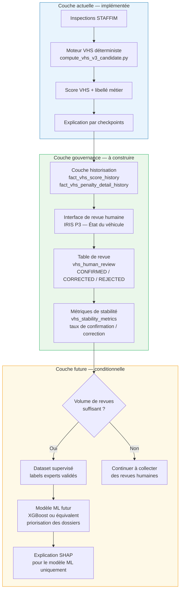

# Architecture de gouvernance du Vehicle Health Score — Human-in-the-loop et historisation

> **Statut :** Document de conception — architecture cible, non encore implémentée  
> **Version :** 1.0 — 2026-07-04  
> **Périmètre :** Module VHS, profil `VHS_BALANCED_V3_CANDIDATE`  
> **Destinataires :** BNA Assurances, encadrement académique, jury technique, équipes production

---

## 1. Objectif du document

Ce document décrit l'architecture de gouvernance cible à construire autour du module **Vehicle Health Score (VHS)** de la plateforme IRIS Auto Fraud Decision Platform.

Le VHS est actuellement un score déterministe, transparent et explicable, fondé sur les points de contrôle STAFFIM. Il est utilisé comme **indicateur d'aide à la décision** à destination des gestionnaires et experts métier de BNA Assurances. Il ne constitue ni un outil d'accusation de fraude, ni un modèle de machine learning.

La prochaine couche de maturité ne consiste **pas à remplacer le VHS**, mais à l'entourer d'une infrastructure de gouvernance couvrant :

| Couche | Objectif |
|--------|----------|
| **Historisation** | Conserver chaque score calculé, avec son contexte et sa version de règles |
| **Validation humaine** | Permettre au gestionnaire ou à l'expert de confirmer, corriger ou rejeter une proposition |
| **Métriques de stabilité** | Mesurer la confiance du métier dans les propositions VHS au fil du temps |
| **Futur supervisé** | Préparer, si les données le permettent, un futur modèle d'apprentissage supervisé basé sur les revues humaines |

La décision finale reste en toutes circonstances sous responsabilité humaine.

> **IRIS propose un niveau d'attention, le gestionnaire ou l'expert métier conserve la décision finale.**

---

## 2. Positionnement du VHS actuel

### 2.1 Module technique validé

| Paramètre | Valeur |
|-----------|--------|
| Script actif | `etl/mart/compute_vhs_v3_candidate.py` |
| Profil | `VHS_BALANCED_V3_CANDIDATE` |
| Run de référence validé | `VHS_BALANCED_V3_CANDIDATE_20260703_181257` |
| Inspections scorées | 286 |
| Anomalies de mapping | 0 |
| Statut global | Validé — candidat final |

### 2.2 Distribution finale des niveaux d'attention

| Code technique | Libellé métier | Nombre | % |
|----------------|----------------|-------:|---|
| OK | État satisfaisant | 89 | 31,1 % |
| DEGRADE | État à surveiller | 133 | 46,5 % |
| IMMOBILISE | Usage déconseillé | 13 | 4,5 % |
| CRITIQUE | Examen prioritaire suggéré | 51 | 17,8 % |
| **Total** | | **286** | **100 %** |

### 2.3 Nature du score

Le VHS est un score **déterministe** : pour un même ensemble de points de contrôle STAFFIM et une même version de règles, il produit toujours le même résultat. Il n'est **pas probabiliste** et ne modélise pas une probabilité de sinistre ou de fraude.

Le VHS est **explicable directement** par les contributions des points de contrôle, sans recours à une méthode d'explicabilité de type SHAP. L'utilisation de SHAP serait pertinente pour un modèle boîte noire ; elle est sans objet pour un moteur de scoring déterministe.

Le VHS est un **outil d'aide à la décision**. Il ne constitue pas un jugement automatique sur la conformité ou la régularité d'un dossier.

---

## 3. Architecture cible

### 3.1 Vue d'ensemble



### 3.2 Principes structurants

**Le moteur VHS reste stable et auditable.** Aucune modification du script de calcul ne doit être réalisée sans révision formelle de version (`dim_vhs_rule_version`).

**L'historisation capture ce qui a été calculé.** Chaque score produit est conservé avec son contexte d'exécution, sa version de règles et son explication checkpoint.

**La revue humaine capture ce qui a été accepté, corrigé ou rejeté.** C'est la source de vérité métier sur la pertinence des propositions VHS.

**Les métriques de stabilité mesurent la confiance du métier.** Un taux de confirmation élevé indique que les règles VHS sont bien calibrées ; un taux de correction élevé signale un besoin de révision des seuils.

**Le futur ML n'est possible qu'après accumulation suffisante de revues humaines fiables.** Il ne remplace pas le VHS ; il peut le compléter pour la priorisation des dossiers.

---

## 4. Modèle de données proposé — tables de gouvernance

> **Note de conception :** Les tables décrites ci-dessous constituent une **proposition d'architecture**. Elles ne sont pas encore créées en base de données. Leur implémentation fera l'objet de la Phase 2 de la feuille de route.

---

### A. `mart.dim_vhs_rule_version`

**Objectif :** Référencer chaque version de règles VHS ayant produit des scores.

| Colonne | Type suggéré | Description |
|---------|-------------|-------------|
| `rule_version_id` | INTEGER PK | Identifiant unique de version |
| `profile_name` | VARCHAR | Nom du profil (ex. `VHS_BALANCED_V3_CANDIDATE`) |
| `rule_version_label` | VARCHAR | Libellé lisible (ex. `V3 — correctif IMMOBILISE`) |
| `active_script` | VARCHAR | Chemin du script actif |
| `description` | TEXT | Description des changements apportés |
| `created_at` | TIMESTAMP | Date de création |
| `created_by` | VARCHAR | Auteur ou système ayant enregistré la version |
| `is_active` | BOOLEAN | Version courante en production |
| `notes` | TEXT | Notes complémentaires, références, liens |

**Usage métier :** Répondre à la question « Quelle version de règles a produit ce score ? »

---

### B. `mart.fact_vhs_score_history`

**Objectif :** Stocker chaque score VHS calculé, avec son contexte d'exécution.

| Colonne | Type suggéré | Description |
|---------|-------------|-------------|
| `vhs_score_history_id` | BIGINT PK | Identifiant unique |
| `run_id` | VARCHAR | Identifiant de run d'exécution |
| `profile_name` | VARCHAR | Profil VHS utilisé |
| `inspection_id` | VARCHAR | Identifiant de l'inspection STAFFIM |
| `vehicle_key` | VARCHAR | Clé du véhicule (anonymisée si nécessaire) |
| `score_value` | NUMERIC | Score VHS final [0, 100] |
| `technical_grade` | CHAR(1) | Note technique (A / B / C / D) |
| `business_grade_label` | VARCHAR | Libellé métier de la note |
| `technical_decision` | VARCHAR | Décision technique (OK / DEGRADE / IMMOBILISE / CRITIQUE) |
| `business_decision_label` | VARCHAR | Libellé métier (État satisfaisant, etc.) |
| `created_at` | TIMESTAMP | Date du calcul |
| `is_current` | BOOLEAN | Score le plus récent pour cette inspection |

**Usage métier :** Répondre à la question « Quel score a été proposé pour cette inspection, à quelle date, et avec quelle version de règles ? »

---

### C. `mart.fact_vhs_penalty_detail_history`

**Objectif :** Stocker l'explication checkpoint par checkpoint pour chaque score.

| Colonne | Type suggéré | Description |
|---------|-------------|-------------|
| `vhs_penalty_detail_history_id` | BIGINT PK | Identifiant unique |
| `run_id` | VARCHAR | Identifiant de run d'exécution |
| `inspection_id` | VARCHAR | Identifiant de l'inspection |
| `checkpoint_code` | VARCHAR | Code STAFFIM du point de contrôle |
| `checkpoint_label` | VARCHAR | Libellé lisible du point de contrôle |
| `raw_value` | VARCHAR | Valeur brute observée |
| `normalized_status` | VARCHAR | Statut normalisé (OK / WORN / WORN_STRONG / BROKEN / REPAIRED) |
| `business_status_label` | VARCHAR | Libellé métier du statut |
| `penalty_value` | NUMERIC | Pénalité appliquée (signée, négatif) |
| `penalty_abs` | NUMERIC | Valeur absolue de la pénalité |
| `tier` | VARCHAR | Niveau de sévérité du checkpoint |
| `is_immobilizing` | BOOLEAN | Point de contrôle immobilisant en V3 |
| `created_at` | TIMESTAMP | Date de calcul |

**Usage métier :** Répondre à la question « Pourquoi le score a-t-il diminué ? Quel point de contrôle a contribué le plus ? »

---

### D. `mart.vhs_human_review`

**Objectif :** Stocker la validation ou la correction effectuée par le gestionnaire ou l'expert.

| Colonne | Type suggéré | Description |
|---------|-------------|-------------|
| `review_id` | BIGINT PK | Identifiant unique de revue |
| `run_id` | VARCHAR | Identifiant du run ayant produit le score |
| `inspection_id` | VARCHAR | Identifiant de l'inspection concernée |
| `vhs_score_value` | NUMERIC | Score proposé par VHS |
| `vhs_technical_decision` | VARCHAR | Décision technique proposée |
| `vhs_business_label` | VARCHAR | Libellé métier proposé |
| `expert_decision` | VARCHAR | Décision retenue par l'expert |
| `expert_decision_label` | VARCHAR | Libellé métier de la décision retenue |
| `review_status` | VARCHAR | Statut de revue (voir ci-dessous) |
| `reviewer_role` | VARCHAR | Rôle du relecteur (gestionnaire, expert, superviseur) |
| `reviewed_by` | VARCHAR | Identifiant du relecteur |
| `reviewed_at` | TIMESTAMP | Date et heure de la revue |
| `review_comment` | TEXT | Commentaire libre du relecteur |
| `correction_reason` | VARCHAR | Motif de correction si applicable |
| `created_at` | TIMESTAMP | Date d'insertion |

**Valeurs autorisées pour `review_status` :**

| Statut | Signification |
|--------|---------------|
| `PENDING` | En attente de revue |
| `CONFIRMED` | Niveau proposé confirmé par l'expert |
| `CORRECTED` | Niveau proposé modifié par l'expert |
| `REJECTED` | Proposition rejetée (inspection à requalifier) |
| `NEEDS_MORE_INFO` | Information complémentaire demandée |

**Usage métier :** Répondre à la question « L'expert a-t-il confirmé le niveau proposé ? Si non, pourquoi et quelle correction a été apportée ? »

---

### E. `mart.vhs_stability_metrics`

**Objectif :** Mesurer la stabilité et la fiabilité métier des propositions VHS dans le temps.

| Colonne | Type suggéré | Description |
|---------|-------------|-------------|
| `metric_date` | DATE | Date ou période de calcul (hebdomadaire, mensuel) |
| `profile_name` | VARCHAR | Profil VHS évalué |
| `business_decision_label` | VARCHAR | Libellé métier analysé |
| `proposed_count` | INTEGER | Nombre de fois que ce niveau a été proposé |
| `confirmed_count` | INTEGER | Confirmations par les experts |
| `corrected_count` | INTEGER | Corrections apportées |
| `rejected_count` | INTEGER | Rejets |
| `confirmation_rate` | NUMERIC | `confirmed_count / proposed_count` |
| `correction_rate` | NUMERIC | `corrected_count / proposed_count` |
| `top_corrected_checkpoint` | VARCHAR | Point de contrôle le plus souvent à l'origine des corrections |
| `created_at` | TIMESTAMP | Date d'insertion |

**Usage métier :** Suivre si les décisions VHS sont approuvées par le métier ou si les règles nécessitent un ajustement.

---

## 5. Workflow human-in-the-loop

### 5.1 Description du circuit

Le circuit de revue humaine suit les étapes suivantes :

1. **Calcul VHS** — Le moteur déterministe calcule un score et attribue un niveau d'attention pour chaque inspection STAFFIM.

2. **Affichage IRIS** — La plateforme IRIS présente au gestionnaire ou à l'expert :
   - le score numérique (sur 100),
   - le niveau d'attention sous forme de libellé métier,
   - les principaux points de contrôle relevés, traduits en langage accessible.

3. **Revue humaine** — Le gestionnaire ou l'expert choisit parmi les actions suivantes :

   | Action | Description | Statut enregistré |
   |--------|-------------|-------------------|
   | **Confirmer** | Le niveau proposé est jugé pertinent | `CONFIRMED` |
   | **Corriger** | Le niveau est modifié et un motif est renseigné | `CORRECTED` |
   | **Demander une vérification** | Une information manque pour statuer | `NEEDS_MORE_INFO` |
   | **Rejeter** | La proposition est inadaptée au dossier | `REJECTED` |

4. **Traçabilité** — Le commentaire, la décision et le motif sont enregistrés dans `mart.vhs_human_review`.

5. **Mise à jour des métriques** — Les indicateurs de stabilité dans `mart.vhs_stability_metrics` sont recalculés périodiquement.

### 5.2 Exemples concrets

---

**Exemple 1 — Confirmation**

> IRIS propose : **Usage déconseillé**  
> Motif : Défaut confirmé sur le point de contrôle niveau d'huile moteur.  
> Action de l'expert : confirme le niveau proposé.  
> Résultat enregistré : `CONFIRMED`  
> Impact sur les métriques : confirmation_rate d'«Usage déconseillé» s'améliore.

---

**Exemple 2 — Correction**

> IRIS propose : **Examen prioritaire suggéré**  
> Motif : Plusieurs points de contrôle en anomalie.  
> Action de l'expert : corrige en **État à surveiller**.  
> Motif renseigné : défauts jugés non bloquants après revue technique.  
> Résultat enregistré : `CORRECTED`  
> Impact sur les métriques : correction_rate d'«Examen prioritaire suggéré» augmente pour cette période ; le checkpoint concerné est identifié comme source de corrections fréquentes.

---

## 6. Implications pour l'interface utilisateur

La revue humaine doit être intégrée dans la page **IRIS P3 — État du véhicule**.

### 6.1 Structure d'affichage recommandée

```
┌─────────────────────────────────────────────────────┐
│  ÉTAT TECHNIQUE DU VÉHICULE                         │
├─────────────────────────────────────────────────────┤
│  Indicateur d'état         [████████░░]  72 / 100  │
│  Niveau proposé            État à surveiller        │
├─────────────────────────────────────────────────────┤
│  POINTS PRINCIPAUX RELEVÉS                          │
│  • Direction — Défaut confirmé                      │
│  • Pneus avant — Intervention conseillée            │
│  • Freins arrière — Conforme                        │
├─────────────────────────────────────────────────────┤
│  VALIDATION GESTIONNAIRE                            │
│  [ Confirmer ]  [ Corriger ]  [ Vérification ]      │
│  Commentaire : ______________________________       │
├─────────────────────────────────────────────────────┤
│  ⚠ Les éléments présentés constituent une aide     │
│  à l'analyse. La décision finale reste sous la      │
│  responsabilité du gestionnaire.                    │
└─────────────────────────────────────────────────────┘
```

### 6.2 Vocabulaire à adopter

| Terme technique (interne) | Libellé métier (interface) |
|---------------------------|---------------------------|
| WORN_STRONG | Intervention conseillée |
| BROKEN | Défaut confirmé |
| WORN | Point à surveiller |
| REPAIRED | Réparation enregistrée |
| is_immobilizing | Point de contrôle sensible |
| penalty | Impact sur l'indicateur |
| normalized_status | État du point de contrôle |
| hard_cap | Niveau d'attention prioritaire |

Les termes techniques ne doivent jamais apparaître dans l'interface utilisateur. Seuls les libellés métier sont exposés.

---

## 7. Métriques de stabilité

### 7.1 Indicateurs principaux

| Indicateur | Formule | Interprétation |
|-----------|---------|----------------|
| Taux de confirmation global | `confirmés / proposés` | Confiance générale dans VHS |
| Taux de correction global | `corrigés / proposés` | Fréquence des désaccords |
| Taux de rejet | `rejetés / proposés` | Propositions inadaptées |
| Taux de confirmation par niveau | Par libellé métier | Calibration par catégorie |
| Taux de correction — Usage déconseillé | `corrigés(IMMOBILISE) / proposés(IMMOBILISE)` | Sévérité du cap immobilisant |
| Taux de correction — Examen prioritaire | `corrigés(CRITIQUE) / proposés(CRITIQUE)` | Précision du cap critique |
| Checkpoints sources de corrections | Top N par fréquence | Règles à réviser en priorité |
| Dérive mensuelle de distribution | Variation du % par niveau | Détection de dérives temporelles |
| Stabilité du score | Écart-type du score moyen mensuel | Régularité du moteur |
| Cas nécessitant plus d'information | `NEEDS_MORE_INFO / proposés` | Zones d'incertitude métier |

### 7.2 Exemple de tableau de bord

| Niveau proposé | Proposés | Confirmés | Corrigés | Taux confirmation |
|----------------|----------|-----------|----------|-------------------|
| État satisfaisant | 89 | — | — | — |
| État à surveiller | 133 | — | — | — |
| Usage déconseillé | 13 | 11 | 2 | **84,6 %** |
| Examen prioritaire suggéré | 51 | — | — | — |

> *Données illustratives — les taux de confirmation seront calculés après collecte des revues humaines.*

Ces métriques permettent de déterminer si les règles VHS sont stables ou si des ajustements de seuils sont nécessaires. Un taux de correction supérieur à 20 % sur un niveau donné devrait déclencher une revue des règles correspondantes avec l'équipe BNA Assurances.

---

## 8. Feuille de route vers un futur modèle supervisé

### 8.1 Positionnement

**XGBoost n'est pas une composante du VHS actuel.** Le VHS est un moteur déterministe, non un modèle d'apprentissage automatique. Introduire XGBoost ou tout autre algorithme supervisé prématurément — sans données étiquetées fiables — produirait un modèle non calibré et non explicable.

La voie vers un futur modèle supervisé passe obligatoirement par :

1. L'accumulation d'un volume suffisant de **revues humaines fiables** dans `mart.vhs_human_review`.
2. La construction d'un **dataset supervisé** à partir de ces revues.
3. La **validation métier** des cibles d'apprentissage envisagées.

### 8.2 Cibles supervisées envisageables

| Cible candidate | Description | Condition préalable |
|-----------------|-------------|---------------------|
| `expert_confirms_proposed` | L'expert confirme le niveau VHS | ≥ 500 revues humaines |
| `dossier_needs_review` | Le dossier nécessite une attention renforcée | ≥ 500 revues avec motif |
| `expert_corrects_upward` | Niveau corrigé vers la hausse (plus grave) | ≥ 200 corrections motivées |
| `expert_corrects_downward` | Niveau corrigé vers la baisse (moins grave) | ≥ 200 corrections motivées |

### 8.3 Rôle futur de SHAP

SHAP serait pertinent **uniquement pour expliquer un futur modèle ML**, et non pour le VHS actuel. Son usage supposera :
- un modèle entraîné et validé,
- des prédictions non déterministes à expliquer,
- un public technique capable d'interpréter les valeurs SHAP.

Pour les utilisateurs non techniques de BNA Assurances, les explications VHS resteront fondées sur les libellés métier des checkpoints.

> **Le modèle supervisé futur ne doit pas remplacer la décision métier ; il doit aider à prioriser et à expliquer les dossiers nécessitant une attention renforcée.**

---

## 9. Principes de gouvernance

L'architecture proposée repose sur les neuf principes suivants :

| Principe | Description |
|----------|-------------|
| **Transparence** | Chaque score est explicable par ses composants de calcul |
| **Traçabilité** | Chaque décision est horodatée, versionnée et auditable |
| **Responsabilité humaine** | La décision finale appartient toujours au gestionnaire |
| **Auditabilité** | L'historique complet des scores et revues est conservé |
| **Absence d'accusation automatique** | VHS ne constitue pas un jugement de fraude ou de non-conformité |
| **Absence de rejet automatique** | Aucun dossier n'est écarté par le seul score VHS |
| **Contrôle de version des règles** | Toute modification du moteur fait l'objet d'une entrée dans `dim_vhs_rule_version` |
| **Séparation score / ML futur** | Le VHS déterministe et un futur modèle supervisé coexistent sans interférence |
| **Validation métier avant production** | Toute mise en production nécessite l'approbation formelle de BNA Assurances |

---

## 10. Feuille de route d'implémentation

### Phase 1 — Documentation et architecture *(en cours)*

- [x] Document de gouvernance (ce fichier)
- [x] Conception des tables de gouvernance
- [x] Conception du workflow de revue humaine
- [ ] Validation de l'architecture par BNA Assurances

### Phase 2 — Historisation technique

- [ ] Création de `mart.dim_vhs_rule_version`
- [ ] Création de `mart.fact_vhs_score_history`
- [ ] Création de `mart.fact_vhs_penalty_detail_history`
- [ ] Alimentation des tables à partir du run de référence validé

### Phase 3 — Workflow de revue humaine

- [ ] Création de `mart.vhs_human_review`
- [ ] Intégration de la file de revue dans IRIS P3
- [ ] Ajout des actions de validation dans l'interface
- [ ] Formation des gestionnaires aux libellés métier

### Phase 4 — Surveillance de la stabilité

- [ ] Création de `mart.vhs_stability_metrics`
- [ ] Calcul périodique des taux de confirmation et de correction
- [ ] Identification des checkpoints sources de corrections fréquentes
- [ ] Tableau de bord de suivi (mensuel)

### Phase 5 — Futur modèle supervisé *(conditionnel)*

- [ ] Constitution du dataset supervisé à partir des revues humaines
- [ ] Entraînement d'un modèle candidat
- [ ] Évaluation des performances et de la fiabilité
- [ ] Ajout de l'explicabilité SHAP pour le modèle ML uniquement
- [ ] Maintien du human-in-the-loop sur les prédictions ML

---

## 11. Limites et précautions

| Limite | Description |
|--------|-------------|
| **Volume de validation actuel** | La validation porte sur 286 inspections STAFFIM d'un run unique. Elle ne couvre pas la variabilité saisonnière ou géographique. |
| **Labels humains requis avant ML** | Aucun modèle supervisé ne peut être entraîné sans revues humaines suffisantes et fiables. |
| **VHS ≠ probabilité de fraude** | Le score VHS mesure l'état technique du véhicule, pas la probabilité d'un sinistre frauduleux. |
| **VHS ≠ modèle actuariel** | VHS n'est pas un outil de tarification ni de calcul de prime. |
| **Validation BNA requise avant production** | Toute mise en production d'une nouvelle version ou d'une nouvelle couche de gouvernance requiert l'approbation formelle de BNA Assurances. |
| **Explicabilité non technique** | Les décisions doivent rester compréhensibles par des utilisateurs non techniques. Les termes internes (WORN_STRONG, hard_cap, penalty) ne doivent pas apparaître dans les interfaces métier. |
| **Dérive des données** | Si la nomenclature STAFFIM évolue, les règles de mapping VHS devront être révisées et la version incrémentée dans `dim_vhs_rule_version`. |

---

## 12. Conclusion

L'architecture de gouvernance proposée dans ce document renforce le module VHS sans modifier son moteur déterministe validé. Elle répond à trois besoins fondamentaux pour une mise en production responsable :

**Mémoire institutionnelle** — L'historisation des scores et des explications garantit que BNA Assurances pourra, à tout moment, retrouver ce qui a été calculé, pourquoi, et avec quelle version de règles.

**Légitimité métier** — Le workflow human-in-the-loop place le gestionnaire au centre de la décision. IRIS propose, l'expert tranche. Cette séparation claire entre assistance et décision protège à la fois les assurés et les équipes BNA.

**Évolutivité maîtrisée** — La collecte structurée des revues humaines prépare, si les volumes le permettent, la construction d'un futur modèle supervisé qui complètera — sans le remplacer — le moteur VHS déterministe.

> *L'architecture proposée prépare le module VHS à un usage entreprise en ajoutant historisation, validation humaine, surveillance de la stabilité et une trajectoire vers l'apprentissage supervisé conditionnel à la collecte des retours métier — sans aucune modification du moteur de calcul validé.*

---

*Document créé dans le cadre du projet IRIS Auto Fraud Decision Platform — PFE 2026.*  
*Aucun code de production n'a été modifié dans le cadre de la rédaction de ce document.*
