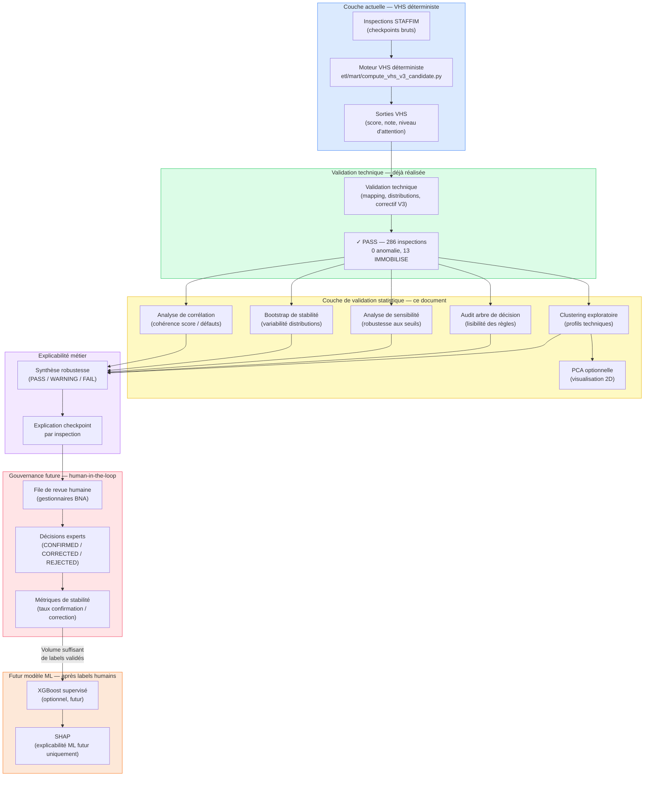

# Plan de validation statistique complémentaire du Vehicle Health Score

> **Document de planification méthodologique — Module VHS**
> **Version :** 1.0 — 2026-07-04
> **Profil de référence :** `VHS_BALANCED_V3_CANDIDATE`
> **Destinataires :** BNA Assurances, encadrement académique, jury technique

---

## 1. Objectif du document

Ce document définit la stratégie de validation statistique complémentaire du module Vehicle Health Score (VHS). Il précise les méthodes retenues, leur rôle, leur périmètre d'application et les critères d'interprétation des résultats.

Le VHS est un **score déterministe à base de règles métier**. Il produit un résultat reproductible, auditable et explicable sans recours à un modèle d'apprentissage automatique. Cette nature déterministe est un choix de conception délibéré, justifié par les exigences d'explicabilité, d'auditabilité et de conformité métier de BNA Assurances.

La couche de validation statistique n'a pas pour objet de remplacer le moteur VHS ni de le remettre en cause. Elle vise à :

- **tester la robustesse** des distributions de score sur l'échantillon disponible,
- **vérifier la cohérence** interne du score vis-à-vis des indicateurs techniques observés,
- **mesurer la stabilité** des décisions métier face à de légères variations de paramètres,
- **renforcer la crédibilité académique et professionnelle** du module avant toute mise en production.

> **"Les méthodes statistiques présentées dans ce document ne constituent pas le moteur VHS ; elles servent à challenger, valider et stabiliser le score existant."**

Aucune méthode statistique présentée ici ne modifie les règles de calcul du score, les seuils de décision ou les libellés métier. Toutes les analyses sont conduites en **lecture seule** sur les données produites par le moteur VHS déterministe existant.

---

## 2. Positionnement du VHS

### 2.1 Rappel du fonctionnement

Le VHS est fondé sur les **points de contrôle STAFFIM** issus des inspections techniques des véhicules. À partir de ces données, le moteur déterministe (`etl/mart/compute_vhs_v3_candidate.py`) produit pour chaque inspection :

| Sortie | Description |
|--------|-------------|
| **Score numérique** | Valeur entre 0 et 100 représentant l'état technique agrégé |
| **Note technique** | A / B / C / D — catégorisation ordinale du score |
| **Niveau d'attention métier** | Libellé décisionnel lisible par les gestionnaires BNA |

Les niveaux d'attention métier sont les suivants :

| Code technique | Libellé métier affiché |
|----------------|----------------------|
| `OK` | État satisfaisant |
| `DEGRADE` | État à surveiller |
| `IMMOBILISE` | Usage déconseillé |
| `CRITIQUE` | Examen prioritaire suggéré |

### 2.2 Ce que le VHS n'est pas

Il est important de clarifier ce que le VHS ne prétend pas être :

- **Pas un modèle ML :** le score est le résultat de règles déterministes, non d'un apprentissage supervisé.
- **Pas une probabilité de fraude :** le VHS évalue l'état technique, non la probabilité d'un sinistre ou d'un comportement frauduleux.
- **Pas un modèle actuariel de risque :** il ne remplace pas les modèles de tarification ou de provisionnement de BNA Assurances.
- **Un indicateur d'aide à la décision :** le VHS propose un signal technique structuré ; la décision finale appartient au gestionnaire ou à l'expert BNA.

### 2.3 Run de référence validé

La présente stratégie de validation s'appuie sur le run de référence suivant :

| Paramètre | Valeur |
|-----------|--------|
| Profil | `VHS_BALANCED_V3_CANDIDATE` |
| Run ID | `VHS_BALANCED_V3_CANDIDATE_20260703_181257` |
| Nombre d'inspections | 286 |
| Lignes de détail checkpoint | 9 724 |
| Anomalies de mapping | 0 |
| Statut de validation technique | PASS |

---

## 3. Architecture méthodologique de validation

Le schéma suivant positionne la couche de validation statistique dans l'architecture globale du module VHS :



### 3.1 Position de la couche statistique

La couche de validation statistique est placée **après la validation technique** (déjà réalisée) et **avant la gouvernance opérationnelle et le ML futur**. Cette position est délibérée :

- La validation technique confirme que le moteur produit des résultats conformes à ses règles.
- La validation statistique vérifie que ces résultats se comportent **de manière cohérente et stable** avant toute utilisation opérationnelle.
- La gouvernance human-in-the-loop et le ML futur ne peuvent s'appuyer sur des labels et des signaux que si le score de base est suffisamment fiable.

En d'autres termes : **il serait prématuré de construire une couche de revue humaine sur un score dont la cohérence statistique n'a pas été vérifiée.**

---

## 4. Méthodes retenues et rôle de chaque méthode

Le tableau suivant présente l'ensemble des méthodes envisagées, leur statut de priorité et leur rôle précis dans la validation du VHS.

| Méthode | Statut | Rôle dans la validation VHS | Remplace le score ? |
|---------|--------|------------------------------|---------------------|
| Analyse de corrélation | Priorité 1 | Vérifier la cohérence entre le score et les indicateurs de défauts | Non |
| Bootstrap de stabilité | Priorité 1 | Estimer la variabilité des distributions sur un petit jeu de données | Non |
| Analyse de sensibilité | Priorité 1 | Tester l'impact de variations de seuils et de pénalités | Non |
| Audit arbre de décision | Priorité 2 | Vérifier si les décisions VHS sont approximables par des règles simples | Non |
| Clustering K-means | Priorité 2 | Segmentation exploratoire des profils techniques de véhicules | Non |
| PCA | Optionnelle | Visualisation et réduction dimensionnelle avant clustering | Non |
| XGBoost | Futur uniquement | Apprentissage supervisé après accumulation de labels humains validés | Non |
| SHAP | Non applicable au VHS actuel | Explication d'un futur modèle ML uniquement | Non |

> **Note importante :** XGBoost et SHAP sont listés pour information sur la feuille de route. Ils sont **hors périmètre** de toute analyse réalisée sur le VHS déterministe actuel.

---

## 5. Analyse de corrélation

### 5.1 Objectif

L'analyse de corrélation vise à vérifier que le score VHS se comporte de manière **cohérente avec les indicateurs techniques observés**. En particulier, on s'attend à ce que le score diminue lorsque le nombre et la sévérité des défauts augmentent.

### 5.2 Variables d'analyse

| Variable | Nature | Comportement attendu |
|----------|--------|---------------------|
| `vhs_score` | Continue [0, 100] | Variable cible |
| `nb_broken` | Entier ≥ 0 | Corrélation négative avec le score |
| `nb_worn_strong` | Entier ≥ 0 | Corrélation négative avec le score |
| `nb_worn` | Entier ≥ 0 | Corrélation négative modérée |
| `nb_repaired` | Entier ≥ 0 | Corrélation faible ou neutre |
| `nb_critical_checkpoints` | Entier ≥ 0 | Corrélation négative forte |
| `nb_critical_broken` | Entier ≥ 0 | Corrélation négative forte |
| `has_immobilizing_broken` | Booléen | Fort lien avec le niveau Usage déconseillé |
| `technical_grade` | Ordinale (A/B/C/D) | Corrélation positive avec le score |
| `business_decision_label` | Catégorielle ordinale | Relation structurée avec le score |

### 5.3 Comportements attendus

- **Corrélation négative forte** entre `vhs_score` et `nb_broken` : plus un véhicule présente de défauts confirmés, plus son score est bas.
- **Corrélation négative** entre `vhs_score` et `nb_worn_strong` : les interventions conseillées pèsent dans le calcul du score.
- **Corrélation négative forte** entre `vhs_score` et `nb_critical_broken` : les défauts sur checkpoints critiques sont les principaux moteurs d'un score bas.
- **Lien structurel fort** entre `has_immobilizing_broken = TRUE` et le niveau d'attention **Usage déconseillé** : cette relation découle directement des règles V3.
- **Corrélation quasi-nulle** entre `vhs_score` et `nb_repaired` : un élément réparé ne devrait pas significativement dégrader le score.

### 5.4 Interprétation

La corrélation ne prouve pas la causalité. Dans le cas du VHS déterministe, les relations causales sont connues et définies par les règles. L'analyse de corrélation sert uniquement à **confirmer empiriquement** que les données produites par le moteur respectent les relations logiques attendues. Une corrélation significativement différente de l'attendu signalerait une anomalie de calcul ou un problème de mapping.

---

## 6. Bootstrap de stabilité

### 6.1 Objectif

Le jeu de données de validation contient **286 inspections**, ce qui est suffisant pour une validation technique et un prototype, mais constitue un échantillon de taille modeste pour des analyses statistiques de distribution. La méthode bootstrap permet d'**estimer la variabilité des distributions** sans nécessiter de données supplémentaires.

### 6.2 Méthode proposée

1. Tirer un échantillon de 286 inspections **avec remise** (bootstrap) depuis le jeu de données de référence.
2. Répéter l'opération **1 000 fois**.
3. Pour chaque tirage, calculer les statistiques suivantes :
   - Moyenne du score VHS
   - Médiane du score VHS
   - Pourcentage d'inspections **État satisfaisant** (`OK`)
   - Pourcentage d'inspections **État à surveiller** (`DEGRADE`)
   - Pourcentage d'inspections **Usage déconseillé** (`IMMOBILISE`)
   - Pourcentage d'inspections **Examen prioritaire suggéré** (`CRITIQUE`)
4. Calculer les **intervalles de confiance à 95 %** (percentiles 2,5 % et 97,5 %) de chaque statistique.

### 6.3 Interprétation des résultats

| Résultat | Interprétation |
|----------|----------------|
| Intervalles étroits | Les distributions sont stables — le score se comporte de manière robuste sur cet échantillon |
| Intervalles larges | La distribution est sensible à la composition de l'échantillon — à interpréter avec prudence |
| Intervalle très large pour `IMMOBILISE` | Attendu — seulement 13 cas sur 286, donc la variance bootstrap sera naturellement plus élevée |

> **Le bootstrap n'invente pas de nouvelles données métier.** Il estime l'incertitude autour des distributions observées. Un intervalle large ne disqualifie pas le score ; il indique qu'une validation sur un échantillon plus large est souhaitable avant généralisation.

---

## 7. Analyse de sensibilité

### 7.1 Objectif

L'analyse de sensibilité teste si les **décisions métier du VHS** changent de manière disproportionnée lorsque certains paramètres du calcul sont légèrement modifiés. L'objectif est de s'assurer que le moteur ne se trouve pas dans une zone de bifurcation où un ajustement marginal de règle provoquerait une instabilité opérationnelle majeure.

### 7.2 Scénarios proposés

| Scénario | Description |
|----------|-------------|
| S1 | Augmenter les pénalités des checkpoints critiques de +10 % |
| S2 | Diminuer les pénalités des checkpoints critiques de -10 % |
| S3 | Augmenter les pénalités `WORN_STRONG` de +10 % |
| S4 | Diminuer les pénalités `WORN_STRONG` de -10 % |
| S5 | Décaler légèrement le seuil de classification `CRITIQUE` |
| S6 | Désactiver temporairement le cap d'immobilisation (à des fins d'audit uniquement) |
| S7 | Comparer les distributions de décisions avant/après chaque scénario |

### 7.3 Métriques de comparaison

Pour chaque scénario, les métriques suivantes sont calculées :

- Nombre absolu de décisions modifiées
- Pourcentage de décisions modifiées
- Nombre de basculements **Usage déconseillé → État à surveiller**
- Nombre de basculements **État à surveiller → Examen prioritaire suggéré**
- Variation de la moyenne du score VHS

### 7.4 Critères d'alerte

- **Acceptable :** moins de 5 % des décisions changent pour une variation de ±10 %.
- **À surveiller :** entre 5 % et 15 % de changement.
- **Signalement requis :** plus de 15 % de décisions modifiées pour une variation de ±10 %.

> **Important :** L'analyse de sensibilité est une **simulation d'audit**. Elle est réalisée en mémoire sur une copie des données et ne modifie en aucun cas le moteur VHS en production (`etl/mart/compute_vhs_v3_candidate.py`).

---

## 8. Audit par arbre de décision

### 8.1 Objectif

Entraîner un **arbre de décision peu profond** comme outil d'audit : si les décisions VHS peuvent être approximées par des règles simples et lisibles, cela renforce la confiance dans la cohérence et l'intelligibilité du score déterministe.

### 8.2 Configuration proposée

**Variables d'entrée potentielles :**

| Variable | Description |
|----------|-------------|
| `vhs_score` | Score numérique agrégé |
| `nb_broken` | Nombre de défauts confirmés |
| `nb_worn_strong` | Nombre d'interventions conseillées |
| `nb_critical_broken` | Défauts sur checkpoints critiques |
| `has_immobilizing_broken` | Présence d'un défaut immobilisant |
| `nb_total_anomalies` | Total des anomalies normalisées |
| `nb_checkpoints` | Nombre de points de contrôle évalués |
| `score_band` | Tranche de score (0-25, 25-50, 50-75, 75-100) |

**Variable cible :** `business_decision_label` (4 classes : OK / DEGRADE / IMMOBILISE / CRITIQUE)

### 8.3 Règles de conduite

- **Arbre peu profond uniquement** : profondeur maximale 3 à 5 niveaux, pour garantir la lisibilité.
- **Pas un modèle de production** : cet arbre ne remplace jamais le moteur VHS.
- **Pas utilisé pour scorer de nouveaux véhicules** : usage exclusivement analytique et pédagogique.
- **Interprétation des branches** : identification des variables qui dominent les décisions VHS.

### 8.4 Interprétation attendue

Si un arbre peu profond reproduit les décisions VHS avec une précision raisonnable (ex. > 85 %), cela suggère que la logique déterministe est **cohérente et compréhensible** — et non arbitraire. Cette convergence renforce la crédibilité métier du score auprès des équipes BNA et du jury académique.

À l'inverse, si l'arbre échoue à reproduire les décisions, cela indique soit une complexité légitime des règles, soit une incohérence à investiguer.

---

## 9. Clustering exploratoire

### 9.1 Objectif

Regrouper les inspections en **profils techniques de véhicules** afin d'identifier si des groupes naturels émergent dans les données STAFFIM. Ces groupes permettent de compléter la lecture par niveaux d'attention VHS avec une segmentation fondée sur les caractéristiques techniques brutes.

### 9.2 Variables d'entrée potentielles

| Variable | Description |
|----------|-------------|
| Proportion de checkpoints `OK` | Part des éléments conformes |
| Proportion de checkpoints `BROKEN` | Part des défauts confirmés |
| Proportion de checkpoints `WORN_STRONG` | Part des interventions conseillées |
| Nombre de checkpoints critiques affectés | Indicateur de sévérité |
| Nombre de familles de checkpoints affectées | Étendue de la dégradation |
| Score VHS | Indicateur global |
| Note encodée ordinalement | A=4, B=3, C=2, D=1 (uniquement pour exploration) |

### 9.3 Clusters possibles

À titre indicatif, les clusters suivants pourraient émerger :

| Cluster pressenti | Description |
|-------------------|-------------|
| Véhicules conformes | Très peu de défauts, score élevé, note A |
| Usure diffuse modérée | Plusieurs `WORN` et `WORN_STRONG`, score intermédiaire |
| Défauts ciblés | Peu de checkpoints affectés mais impact fort (ex. freins, direction) |
| Dégradation technique sévère | Nombreux `BROKEN`, score bas, note D |

### 9.4 Limites et précautions

- Les clusters sont **exploratoires** : ils ne définissent pas de catégories officielles de véhicules.
- Les résultats ne constituent pas des décisions métier et ne remplacent pas les niveaux d'attention VHS.
- L'interprétation des clusters devra être validée avec des experts BNA Assurances pour s'assurer que les groupes identifiés correspondent à une réalité opérationnelle.
- La sensibilité du clustering à l'initialisation (K-means) sera testée par plusieurs tirages aléatoires.

---

## 10. PCA optionnelle

### 10.1 Objectif

L'**Analyse en Composantes Principales (PCA)** est une méthode optionnelle, utilisée uniquement pour la **visualisation et la réduction de dimensionnalité** préalable au clustering. Elle n'est pas un outil d'explication métier.

### 10.2 Utilisation proposée

- **Visualiser les inspections en 2D** : projeter les 286 inspections sur les deux premières composantes principales pour observer leur répartition.
- **Tester la séparabilité naturelle des niveaux VHS** : vérifier si les groupes État satisfaisant, État à surveiller, Usage déconseillé et Examen prioritaire suggéré forment des zones distinctes dans l'espace réduit.
- **Faciliter l'interprétation du clustering** : utiliser la projection 2D comme support visuel pour comprendre la structure des clusters K-means.

### 10.3 Limites

| Limite | Description |
|--------|-------------|
| Non-lisibilité des composantes | Les axes PCA sont des combinaisons linéaires de variables — ils n'ont pas de sens métier direct |
| Perte d'information | Les deux premières composantes ne capturent pas nécessairement toute la variance |
| Non adapté à la communication BNA | La PCA doit rester dans les annexes techniques du notebook, non dans les livrables métier |

> **La PCA ne doit pas être présentée comme méthode d'explication du VHS.** Elle est un outil de visualisation pour les data scientists impliqués dans la validation.

---

## 11. Outputs attendus du futur notebook

Le futur notebook de validation statistique sera créé dans :

```
notebooks/validation_vhs/03_vhs_statistical_robustness_analysis.ipynb
```

Ce document de planification sera la référence pour sa conception. Les sorties attendues du notebook sont les suivantes :

| Section | Output attendu |
|---------|---------------|
| Corrélation | Matrice de corrélation (heatmap + tableau), commentaire sur les signes observés |
| Bootstrap | Intervalles de confiance à 95 % pour chaque distribution, graphiques de densité |
| Sensibilité | Tableau comparatif scénario par scénario, comptage des décisions modifiées |
| Audit arbre | Arbre de décision visualisé, précision sur les 4 classes, règles principales lues |
| Clustering | Profils des clusters, comparaison avec niveaux VHS, visualisation optionnelle |
| PCA (optionnel) | Nuage de points 2D coloré par niveau d'attention, contribution des variables |
| Synthèse finale | Verdict global PASS / WARNING / FAIL pour chaque méthode, recommandations |

### Contraintes du notebook

- **Aucune écriture en base de données** : toutes les analyses sont en lecture seule.
- **Aucune modification du moteur VHS** : le script `etl/mart/compute_vhs_v3_candidate.py` n'est pas touché.
- **Aucun entraînement de modèle ML en production** : l'arbre de décision et le clustering sont des outils d'audit, pas des modèles déployés.
- **Fallback documenté** : si la base de données n'est pas disponible, les résultats seront documentés depuis les fichiers de sortie existants.

---

## 12. Critères d'interprétation

### 12.1 Critères PASS

| Critère | Condition |
|---------|-----------|
| Corrélation cohérente | Les corrélations ont les signes attendus (`nb_broken` < 0, `nb_repaired` ≈ 0) |
| Bootstrap stable | Les intervalles de confiance sont étroits et proches des distributions observées |
| Sensibilité maîtrisée | Moins de 5 % de décisions changent pour ±10 % de variation de pénalité |
| Audit arbre positif | L'arbre peu profond capture les règles dominantes du VHS avec une précision raisonnable |
| Clusters cohérents | Les clusters s'alignent globalement avec les niveaux de sévérité VHS |

### 12.2 Critères WARNING

| Critère | Condition |
|---------|-----------|
| Intervalle bootstrap large | L'intervalle de Usage déconseillé est très large (attendu — 13 cas seulement) |
| Sensibilité modérée | Entre 5 % et 15 % de décisions modifiées pour ±10 % de variation |
| Corrélation faible | Corrélations cohérentes dans le signe mais d'amplitude faible |
| Clusters partiellement alignés | Certains clusters contiennent des mélanges de niveaux d'attention VHS |

### 12.3 Critères FAIL

| Critère | Condition |
|---------|-----------|
| Corrélation inversée | Le score **augmente** quand le nombre de défauts **augmente** |
| Instabilité bootstrap extrême | Les intervalles couvrent quasiment toute la plage [0, 100] |
| Sensibilité excessive | Plus de 15 % de décisions changent pour ±10 % — le moteur est trop sensible aux seuils |
| Logique incohérente | L'arbre de décision ne parvient pas à reproduire une logique interprétable |
| Clusters contradictoires | Les clusters inversent la hiérarchie des niveaux de sévérité VHS |

> **Un résultat WARNING ne disqualifie pas le VHS** ; il indique des zones nécessitant une attention particulière dans la phase de validation métier avec BNA Assurances. Seul un résultat FAIL sur un critère de cohérence fondamental (ex. corrélation inversée) remettrait en question une règle de calcul spécifique.

---

## 13. Limites

### 13.1 Taille du jeu de données

Le run de référence contient **286 inspections**. Ce volume est suffisant pour une validation académique et un prototype fonctionnel. Il présente les limites suivantes pour les analyses statistiques :

- La catégorie **Usage déconseillé** (13 cas) est sous-représentée — les analyses sur cette classe doivent être interprétées avec prudence.
- Le bootstrap **ne crée pas de nouvelles données** ; il estime uniquement la variabilité sur l'échantillon disponible.
- Les résultats ne peuvent pas être généralisés sans validation sur un volume plus important de données saisonnières.

### 13.2 Limites des méthodes

| Méthode | Limite principale |
|---------|-----------------|
| Bootstrap | Ne remplace pas la collecte de nouvelles données réelles |
| Clustering | Résultats dépendants du nombre de clusters k et de l'initialisation |
| PCA | Composantes non directement interprétables en termes métier |
| Arbre de décision | Peut sur-apprendre sur un petit jeu de données (régularisation nécessaire) |
| Sensibilité | Scénarios de perturbation choisis par le concepteur — d'autres scénarios pourraient donner des résultats différents |

### 13.3 Hors périmètre

Les éléments suivants sont **explicitement hors périmètre** de cette couche de validation statistique :

- Aucun label de décision humaine (BNA) n'est encore disponible — **pas de XGBoost** à ce stade.
- **SHAP** n'est applicable qu'à un futur modèle ML ; il est sans objet pour le VHS déterministe.
- La validation métier formelle par BNA Assurances est une étape séparée, conduite avec les équipes opérationnelles.
- Le déploiement des tables de gouvernance en production n'est pas conditionné à cette analyse statistique.

---

## 14. Conclusion

La couche de validation statistique complémentaire constitue une étape essentielle entre la **validation technique** du moteur VHS et son **utilisation opérationnelle** dans la plateforme IRIS. Elle répond à une exigence à la fois académique et professionnelle : un score technique, aussi déterministe soit-il, doit être challengé statistiquement avant d'être utilisé pour orienter des décisions métier.

Les méthodes retenues — corrélation, bootstrap, sensibilité, audit par arbre, clustering exploratoire — sont choisies pour leur **complémentarité** : elles testent respectivement la cohérence, la stabilité, la robustesse, la lisibilité et la structure du score. Aucune d'entre elles ne remet en cause la nature déterministe du VHS ni n'ambitionne de le remplacer.

> **"Le VHS reste un score déterministe et explicable ; les analyses statistiques servent à vérifier sa cohérence, sa stabilité et sa robustesse."**

Cette validation statistique prépare également le terrain pour la gouvernance human-in-the-loop : un score dont la robustesse statistique a été vérifiée offre une base plus solide pour la constitution d'un dataset de labels humains, qui constituera à son tour le socle d'un éventuel futur modèle supervisé.

Le présent document définit le cadre méthodologique. Sa mise en œuvre sera réalisée dans le notebook `notebooks/validation_vhs/03_vhs_statistical_robustness_analysis.ipynb`, en lecture seule sur les données produites par le moteur VHS validé, sans modification d'aucun code de production ni écriture en base de données.

---

| Document lié | Contenu |
|---|---|
| `docs/vhs/vhs_final_module_summary.md` | Synthèse finale du module VHS |
| `docs/vhs/vhs_validation_summary.md` | Synthèse de validation technique |
| `docs/vhs/vhs_calculation_method.md` | Méthode de calcul déterministe |
| `docs/vhs/vhs_business_explanation.md` | Explication métier (BNA-ready) |
| `docs/vhs/governance/vhs_human_in_the_loop_and_history_architecture.md` | Architecture de gouvernance |
| `docs/vhs/governance/vhs_governance_table_design.md` | Design des tables de gouvernance |
| `docs/vhs/governance/sql/001_create_vhs_governance_tables.sql` | DDL proposé (validé en base de test) |
| `notebooks/validation_vhs/01_validate_vhs_balanced_v3_candidate.ipynb` | Notebook de validation technique |
| `notebooks/validation_vhs/03_vhs_statistical_robustness_analysis.ipynb` | Futur notebook — validation statistique |

---

*Document créé dans le cadre du projet IRIS Auto Fraud Decision Platform — PFE 2026.*
*Aucun code de production n'a été modifié. Aucune écriture en base de données.*
